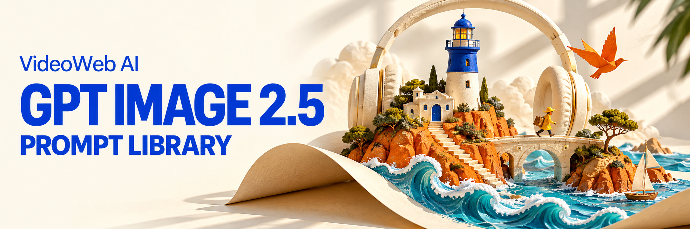
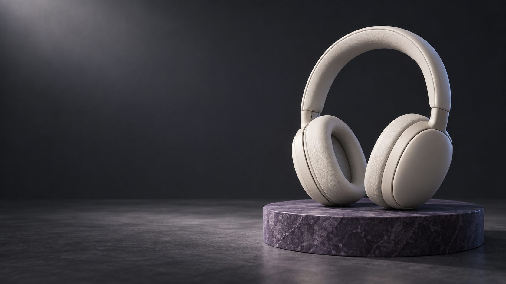
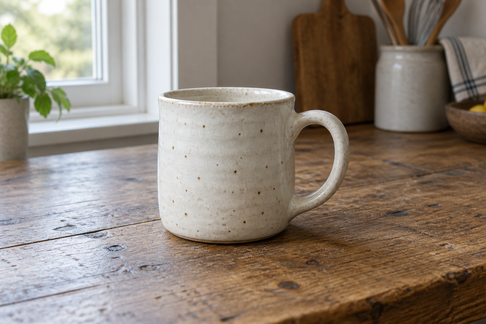
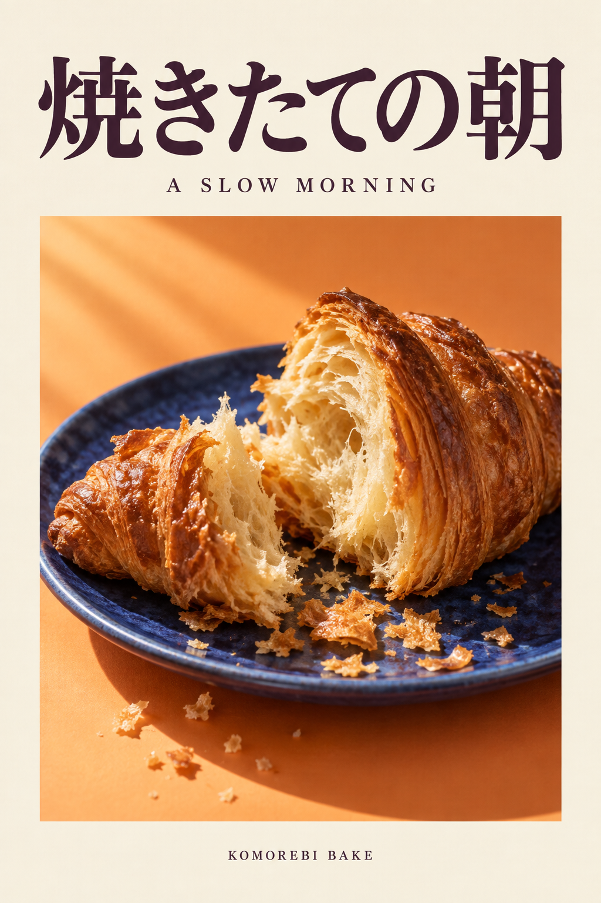
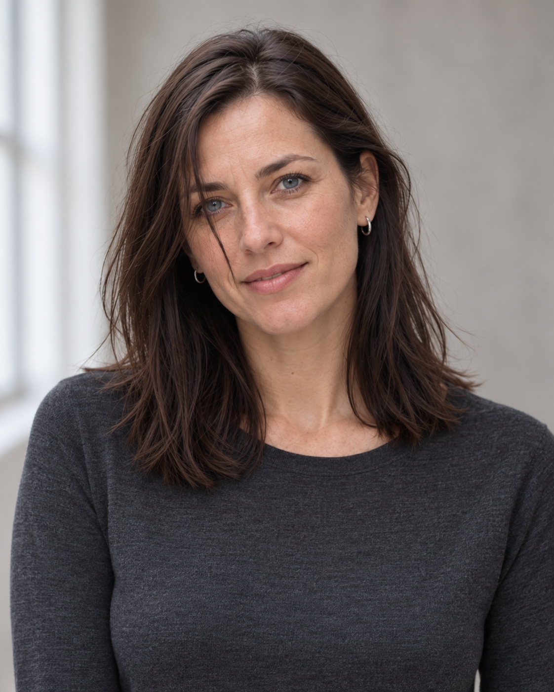
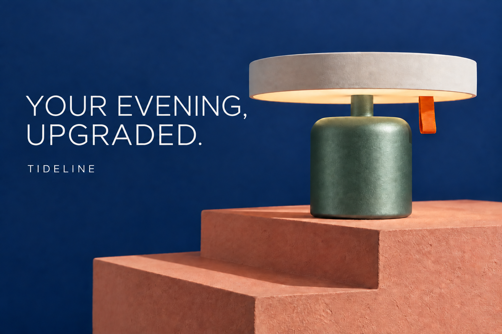

# Awesome GPT Image 2.5 Prompts — VideoWeb AI

Prompts for online shops, designers and video creators: make product campaigns, edit existing images and plan video shots.

**106 illustrated recipes across 16 packs.** Core recipes include required inputs, details to preserve and checks for the result.

[Create with GPT Image 2.5](https://videoweb.ai/model/gpt-image-2-5/) · [Try free without signup](https://videoweb.ai/free-gpt-image-2-5/)

[Three examples](#featured-examples) · [Copy a starter prompt](#quick-start) · [Find a category](#prompt-library) · [Before & after](#editing-examples) · [Video & guides](#learn-more)

**English** · [简体中文](README_zh.md) · [繁體中文](README_tw.md) · [日本語](README_ja.md) · [한국어](README_ko.md) · [Español](README_es.md) · [Français](README_fr.md) · [Deutsch](README_de.md) · [Português (Brasil)](README_pt.md) · [Italiano](README_it.md) · [Русский](README_ru.md) · [العربية](README_ar.md) · [हिन्दी](README_hi.md) · [ไทย](README_th.md) · [Bahasa Indonesia](README_id.md) · [Tiếng Việt](README_vi.md)



<a id="featured-examples"></a>

## Three ways to use the library

| Product campaign | Video storyboard |
| --- | --- |
| [](prompts/16-videoweb-x-creators.md#p094-en) | [](prompts/14-sketch-to-story.md#p084-en) |
| Leave space for copy added later. No reference needed. | Plan nine shots from one performer reference image. |
| [P094 · Prompt](prompts/16-videoweb-x-creators.md#p094-en) | [P084 · Prompt and input](prompts/14-sketch-to-story.md#p084-en) |

The headphone joints are conceptual; the storyboard’s eye close-up and notebook handling need continuity checks. [Generation records](docs/generation-log.md).

### Product photo to white background

| Input: cup in a kitchen setting | Result: white-background catalog image |
| --- | --- |
| [](assets/images/cup-input.png) | [](prompts/01-product.md#p002-en) |

Upload one product photo to change its background and lighting. Glaze speckles and proportions drift slightly in this example; compare the rim, handle and glaze before use.

[P002 · Prompt](prompts/01-product.md#p002-en) · [Download the sample input](assets/images/cup-input.png)

<a id="quick-start"></a>

## Start with your first image

**Starting with an idea?** Copy the lamp prompt below; no upload is needed. Try the default brief once, then replace the brand, product and copy.

**Already have a product photo?** Use the [P002 white-background prompt](prompts/01-product.md#p002-en): replace the cup description and preservation requirements with your product’s details, then upload your photo. Or download the [sample cup input](assets/images/cup-input.png) to practice.

Text-to-image starter:

```text
Create a landscape 3:2 product campaign for the fictional lamp brand TIDELINE.
Use a midnight-blue cylindrical metal base, ivory disc shade and orange pull tab.
Place it on a coral stepped plinth against a navy backdrop, with soft light and natural shadows.
The lamp occupies the right 60%; at left, print only "LIGHT, UNPLUGGED." and "TIDELINE" in white.
Show believable metal texture. One lamp; no extra text or product claims.
```

Check the lettering, shade outline and pull-tab position, then save the approved version. The [editing case below](#editing-examples) shows how to change its color and headline. The [full P001 recipe](prompts/01-product.md#p001-en) includes constraints and checks.

The free tool accepts text or one reference image and requires verification before generation. Multi-image recipes need a tool that supports the required number of uploads.

## Prompt library

<!-- BEGIN GENERATED SHOWCASE -->

Find a specific task across 16 packs and 106 recipes. Prefer to choose by appearance? Open the [complete visual gallery](docs/gallery.md).

| Prompt pack | What you can make | Recipes |
| --- | --- | --- |
| [Product photography & e-commerce](prompts/01-product.md) | Catalog photos, skincare, cutaways, textures, gift boxes | 6 |
| [Ads, social posts & creator covers](prompts/02-social.md) | Event posters, video thumbnails, carousels, podcast covers | 6 |
| [Portraits, fashion & pets](prompts/03-people-pets.md) | Headshots, pet portraits, outfit try-ons, keepsakes | 6 |
| [Precise edits & multi-turn workflows](prompts/04-editing.md) | Recolor, remove objects, relight, replace text, cut out | 6 |
| [Infographics, education & presentations](prompts/05-information.md) | Explainers, charts, maps, plant cycles, workshop slides | 6 |
| [Brand identity & interface concepts](prompts/06-brand-ui.md) | Wordmarks, wayfinding, app screens, landing pages, packaging | 6 |
| [Comics, characters & game art](prompts/07-stories-games.md) | Comics, character sheets, expressions, game icons, pixel art | 6 |
| [Architecture, interiors & hospitality](prompts/08-spaces.md) | Rooms, material refreshes, shops, courtyards, sketch concepts | 6 |
| [Publishing, print & editorial illustration](prompts/09-publishing.md) | Book covers, cookbook spreads, editorial art, zines | 6 |
| [Series, localization & production handoff](prompts/10-production.md) | Seasonal variants, crop changes, localization, composites | 6 |
| [Multilingual posters](prompts/11-multilingual.md) | 12 language-specific posters, from English to Japanese and Arabic | 12 |
| [Launch-inspired editing examples](prompts/12-launch-examples.md) | Before-and-after edits: outfits, duvet, text, itinerary, candles | 7 |
| [Customizable studio briefs](prompts/13-customizable-studio.md) | Adjustable portraits, coffee posters, packaging and miniatures | 6 |
| [Sketch-to-story (10 English, 2 English/Chinese)](prompts/14-sketch-to-story.md) | Sketch exploration, character styles, portrait edits, storyboards | 12 |
| [X community: practical visual briefs](prompts/15-x-community.md) | Food lettering, fragrance boards, travel cards, architecture | 6 |
| [VideoWeb creator briefs from X](prompts/16-videoweb-x-creators.md) | Fashion-film wardrobe, retro opening frames, headphone campaigns | 3 |

<!-- END GENERATED SHOWCASE -->

<a id="posters-portraits-and-spaces"></a>

## More creative examples

| Multilingual poster | Professional portrait |
| --- | --- |
| [](prompts/11-multilingual.md#l003) | [](prompts/03-people-pets.md#p013-en) |
| Arrange Japanese and English copy. No reference needed. | Change the setting and clothing. Portrait required. |
| [L003 · Prompt](prompts/11-multilingual.md#l003) | [P013 · Prompt and input](prompts/03-people-pets.md#p013-en) |

Proofread every character on the poster. Compare the portrait’s facial features, skin tone and hairline with the input.

| Character styles | Interior concept |
| --- | --- |
| [](prompts/14-sketch-to-story.md#p076-en) | [](prompts/08-spaces.md#p043-en) |
| Explore four materials from one character doodle. Reference required. | Specify furniture, materials and light. No reference needed. |
| [P076 · Prompt and input](prompts/14-sketch-to-story.md#p076-en) | [P043 · Prompt](prompts/08-spaces.md#p043-en) |

Check the character’s outfit and accessories across versions. The room is a discussion concept, not a construction drawing.

<a id="editing-examples"></a>

## Before and after: change one part, check the rest

### One edit: three candles become five

| Input: three candles | Edited: five candles |
| --- | --- |
|  |  |

The task changes the count while preserving the cake, plate and composition. Five orange candles are visible; the frosting texture shifts slightly. Use this to practice specifying the change and the preserve list. [P067 prompt, input and review](prompts/12-launch-examples.md#p067-en).

### Two edits: color first, then the headline

| Original | Step 1: recolor the base | Step 2: replace the headline |
| --- | --- | --- |
|  |  |  |

Continue with your saved lamp image, or upload the [blue example](assets/images/tideline-lamp.png). First change only the base:

```text
Change only the lamp base to muted jade green, preserving its shape and metal texture.
Keep the shade, pull tab, text, backdrop, camera and plinth unchanged.
```

Inspect and save the green result; use that image as the next input:

```text
Replace only "LIGHT, UNPLUGGED." with "YOUR EVENING, UPGRADED.".
Preserve the green base, "TIDELINE" brand name, layout, product and lighting.
```

**Why separate the edits:** inspect one change at a time and return to the last approved image if needed. Here the stem also turned green, and texture and highlights drifted slightly; strict product work needs further correction. [Exact executed prompts and full record](docs/editing-case-study.md).

<a id="learn-more"></a>

## Video & further guides

| Your next task | Start here |
| --- | --- |
| Take an approved still into video work | [VideoWeb workflow](docs/videoweb-workflow.md) · [Official demo video](docs/video-guide.md) |
| Explore X community examples | [Sources, original posts and adaptations](docs/x-community.md) |
| Write clearer prompts or troubleshoot edits | [Prompting guide](docs/prompting-guide.md) · [10 practical workflows](docs/playbook.md) |
| Compare models, APIs and tools | [Model notes](docs/model-notes.md) · [Upgrade comparison](docs/images-2-vs-2-5.md) · [API guide](docs/api-guide.md) · [Online tools](docs/tools.md) |
| Create for another language | [Multilingual prompts](prompts/11-multilingual.md) · [Language coverage](docs/localization-guide.md) |

## About the examples and open-source use

Maintained by VideoWeb AI from the [Flaq AI collection](https://github.com/flaqai/awesome-chatgpt-images-2-5-prompts): 103 inherited recipes plus 3 creator additions, across 16 packs and 145 images. There are 78 bilingual English/Chinese recipes, 16 English-only recipes and 12 language-specific briefs.

Examples were made with the project image tool, which did not expose a model ID; they are not verified VideoWeb or model-specific tests. Known text, structure and detail errors are documented in the [generation log](docs/generation-log.md). Third-party X images are credited separately and are not covered by this repository’s MIT license.

[Upstream and maintenance](docs/upstream.md) · [Contributing](CONTRIBUTING.md) · [Originality and rights](docs/originality.md)

## VideoWeb AI affiliate program

We welcome affiliate partnerships with tutorial authors, video creators and tool reviewers. [Join the VideoWeb AI affiliate program](https://videoweb.ai/affiliate-program/); current commissions, eligibility and payouts follow the program terms.

## License

[MIT](LICENSE) © 2026 Flaq AI; VideoWeb AI for brand adaptation and additions. Third-party references retain their own rights.
