# Awesome GPT Image 2.5 Prompts — VideoWeb AI

**A practical, multilingual prompt library for image generation and editing — product photos, ads, portraits, typography, UI concepts, infographics and storyboards.**

[](LICENSE)
[](prompts/README.md)
[](prompts/README.md)

**English** · [简体中文](README_zh.md) · [繁體中文](README_tw.md) · [日本語](README_ja.md) · [한국어](README_ko.md) · [Español](README_es.md) · [Français](README_fr.md) · [Deutsch](README_de.md) · [Português (Brasil)](README_pt.md) · [Italiano](README_it.md) · [Русский](README_ru.md) · [العربية](README_ar.md) · [हिन्दी](README_hi.md) · [ไทย](README_th.md) · [Bahasa Indonesia](README_id.md) · [Tiếng Việt](README_vi.md)


> Maintained by [VideoWeb AI](https://videoweb.ai), adapted from the Flaq AI open-source collection. [Source and credits](docs/upstream.md).

[Start with a prompt](#quick-start) · [Browse use cases](#prompt-library) · [View examples](#featured-examples) · [Create with VideoWeb AI](#create-with-videoweb-ai) · [Join the affiliate program](#videoweb-ai-affiliate-program)

## Create with VideoWeb AI

**[Use GPT Image 2.5](https://videoweb.ai/model/gpt-image-2-5/) · [Try free without signup](https://videoweb.ai/free-gpt-image-2-5/)**

Start with VideoWeb’s GPT Image 2.5 page for image creation and editing. The free tool accepts text or one reference image and requires verification before generation. Choose a recipe, inspect the still, then refine it.


## Quick start

1. Pick a [recipe](prompts/README.md), then copy either its English or Chinese block. Replace the fictional product, copy and colors with your own brief.
2. For an **edit**, upload the required images in their stated order. For a **generation**, no reference is required unless you add one.
3. Review the result, save the approved image, then apply the included follow-up. In a new conversation, upload that approved version again.

Try this inherited Flaq AI quick brief:

```text
Create a landscape 3:2 product campaign for a fictional portable lamp.
Use a midnight-blue cylindrical metal base, ivory disc shade and orange pull tab.
Place the lamp on a coral stepped plinth against navy; soft, believable shadows.
Reserve the left side for exact white text: "LIGHT, UNPLUGGED." and "TIDELINE".
Show natural material texture. One lamp, no extra copy or product claims.
```

Next turn, with the approved image attached:

```text
Change only the lamp base to muted jade green. Preserve its shape and metal texture.
Keep the shade, pull tab, typography, background, camera and plinth unchanged.
```

The [full recipe](prompts/01-product.md#p001) and [exact executed prompt](assets/generation/tideline-lamp.txt) offer more detail.

## Prompt library

| Prompt pack | What you can make | Recipes |
| --- | --- | --- |
| [Product photography & e-commerce](#showcase-01-product) | Lamp ad, cup catalog, skincare still life, grinder cutaway, sneaker detail, gift box | 6 |
| [Ads, social & creator covers](#showcase-02-social) | Repair flyer, video thumbnail, travel carousel, lunch ad, podcast cover, market campaign | 6 |
| [Portraits, fashion & pets](#showcase-03-people-pets) | Natural headshot, pet portrait, jacket try-on, lifestyle photo, couple illustration, watercolor keepsake | 6 |
| [Precise image editing](#showcase-04-editing) | Product recolor, removal, evening relight, text replacement, sketch-guided insertion, cutout | 6 |
| [Infographics & education](#showcase-05-information) | Rain garden, tasting diagram, demo chart, illustrated map, plant cycle, workshop slide | 6 |
| [Brand identity & UI](#showcase-06-brand-ui) | Wordmark, wayfinding, mobile app, landing-page concept, packaging family, dashboard | 6 |
| [Comics, characters & games](#showcase-07-stories-games) | Six-panel story, turnaround, expressions, icons, isometric rooftop, pixel harbor | 6 |
| [Architecture & interiors](#showcase-08-spaces) | Reading room, apartment refresh, guest room, pop-up store, courtyard, pavilion | 6 |
| [Publishing & illustration](#showcase-09-publishing) | Book cover, cookbook spread, annual review, editorial metaphor, ink print, zine | 6 |
| [Series & production handoff](#showcase-10-production) | Seasonal variants, aspect-ratio adaptation, localization, three-image composite, restoration, shot expansion | 6 |
| [Multilingual briefs](#showcase-11-multilingual) | Script-aware posters in English, Chinese, Japanese, Korean, Spanish, French, German, Portuguese, Arabic, Hindi, Thai and Russian | 12 |
| [Launch-inspired editing examples](#showcase-12-launch-examples) | Pet costume, child wardrobe, duvet pattern, souvenir text, cube rotation, itinerary revision, candle count | 7 |
| [Customizable studio briefs](#showcase-13-customizable-studio) | Workshop portrait, pour-over poster, toy packaging, lighthouse miniature, keepsake card, editorial collage | 6 |
| [Sketch-to-story: English workflows](#showcase-14-sketch-to-story) | Sketch interpretation, dense English layout, portrait revisions, branded apparel, action sheets, MV and narrative boards | 12 |
| [X community: source-linked briefs](#showcase-15-x-community) | Food lettering, product storyboards, mobility posters, travel cards, architecture, event invitations | 6 |
| [VideoWeb creator briefs](#showcase-16-videoweb-x-creators) | Fashion-film wardrobe, retro opening, headphone campaign | 3 |

<!-- BEGIN GENERATED SHOWCASE -->

All 16 categories and 106 illustrated recipes are displayed below. Each category includes one complete prompt to copy; other images link to their full recipes.

These are project-generated examples, not verified VideoWeb or model-specific results. Reusable recipes may differ from executed prompts; see the [generation log](docs/generation-log.md) for inputs and known limitations. Editing recipes require references; use a tool supporting multiple uploads for multi-image tasks.

<a id="showcase-01-product"></a>

### Product photography & e-commerce · 6

| | | |
| --- | --- | --- |
| [](prompts/01-product.md#p001)<br>**[P001 · Portable lamp campaign](prompts/01-product.md#p001)** | [](prompts/01-product.md#p002)<br>**[P002 · Ceramic cup catalog](prompts/01-product.md#p002)** | [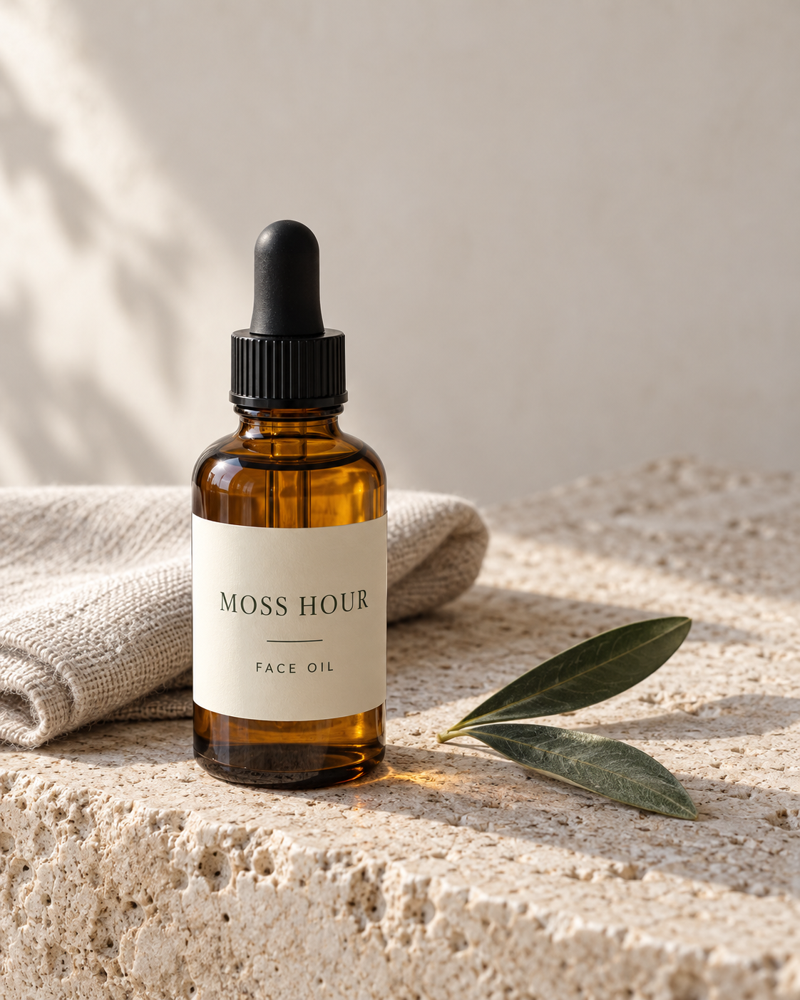](prompts/01-product.md#p003)<br>**[P003 · Skincare ingredient still life](prompts/01-product.md#p003)** |
| [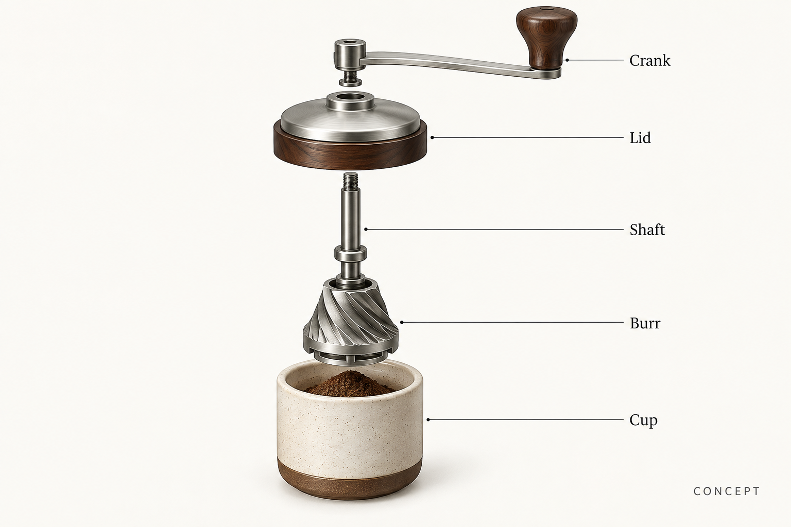](prompts/01-product.md#p004)<br>**[P004 · Mechanical coffee grinder cutaway](prompts/01-product.md#p004)** | [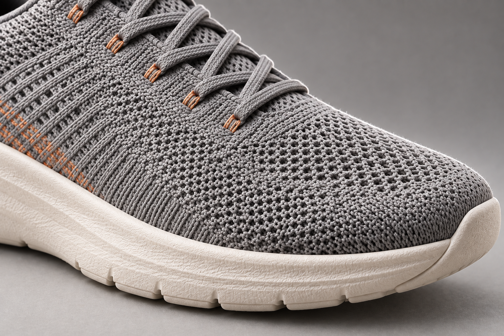](prompts/01-product.md#p005)<br>**[P005 · Sneaker texture detail](prompts/01-product.md#p005)** | [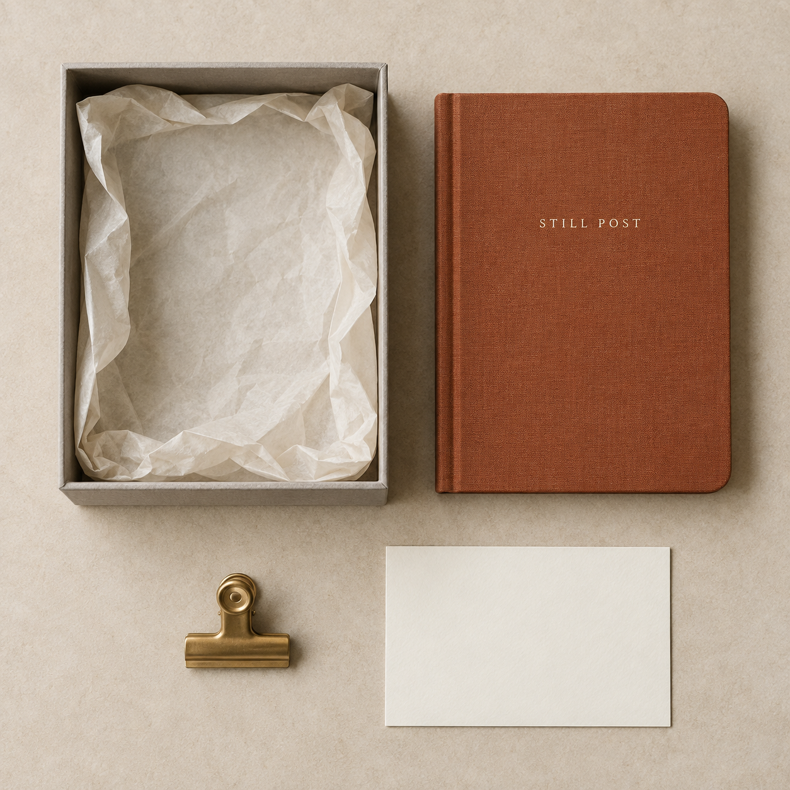](prompts/01-product.md#p006)<br>**[P006 · Gift box unboxing flat lay](prompts/01-product.md#p006)** |

**Copy this prompt · P001**

Input: no reference upload is needed for this default example.

```text
Asset: Portable lamp campaign. Target aspect ratio: 3:2. Mode: generate.
Art-direct an original TIDELINE portable lamp campaign. Put a squat midnight-blue metal base with an ivory disc shade and orange fabric pull tab on a coral stepped plinth. Light the underside warmly against a deep navy backdrop. Product occupies the right 60%; use spacious white typography at left: "LIGHT, UNPLUGGED." and "TIDELINE". Photograph plausible anodized metal texture and soft shadows.
Constraints: One lamp; no invented battery claims or extra text.
Render only explicitly requested image text. Do not add unrelated logos, signatures or captions.
```

**Next edit：** Change only the base finish to muted jade; preserve shade, pull tab, framing and copy.

**Check the result：** Check text character by character and compare shade outline and tab placement.

[All prompts and usage notes in this category](prompts/01-product.md) · [Back to categories](#prompt-library)

<a id="showcase-02-social"></a>

### Ads, social posts & creator covers · 6

| | | |
| --- | --- | --- |
| [](prompts/02-social.md#p007)<br>**[P007 · Repair café event poster](prompts/02-social.md#p007)** | [](prompts/02-social.md#p008)<br>**[P008 · Creator thumbnail with one idea](prompts/02-social.md#p008)** | [](prompts/02-social.md#p009)<br>**[P009 · Carousel cover for slow travel](prompts/02-social.md#p009)** |
| [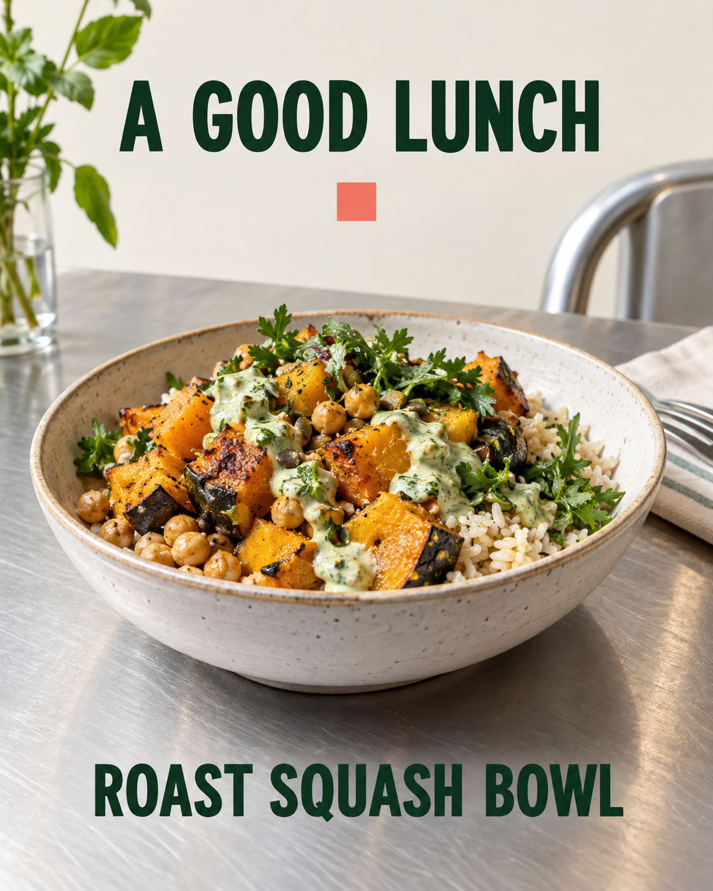](prompts/02-social.md#p010)<br>**[P010 · Neighborhood lunch special](prompts/02-social.md#p010)** | [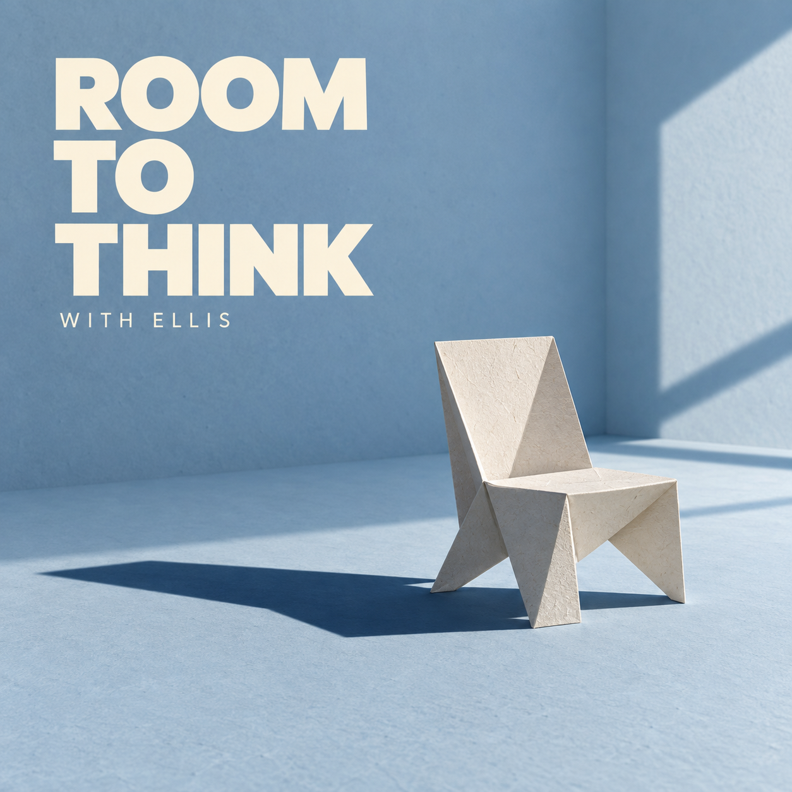](prompts/02-social.md#p011)<br>**[P011 · Podcast editorial cover](prompts/02-social.md#p011)** | [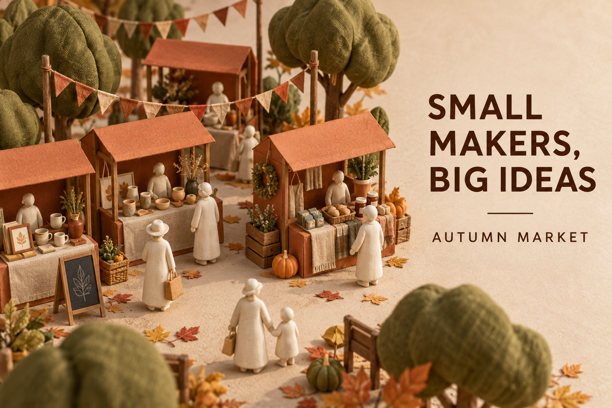](prompts/02-social.md#p012)<br>**[P012 · Seasonal market campaign](prompts/02-social.md#p012)** |

**Copy this prompt · P007**

Input: no reference upload is needed for this default example.

```text
Asset: Repair café event poster. Target aspect ratio: 2:3. Mode: generate.
Create a community poster on recycled cream paper. An overhead arrangement of a small screwdriver, orange thread spool and repaired blue mug forms a loose circle. Large ink-blue headline "FIX IT TOGETHER" sits above; below use "SAT 14 NOV", "10:00–16:00", "RIVER HALL". A bright vermilion line ties the typography together. Flat print artwork with generous margins.
Constraints: Fictional event; no QR code, sponsors, prices or unprovided details.
Render only explicitly requested image text. Do not add unrelated logos, signatures or captions.
```

**Next edit：** Replace only the date with "SAT 21 NOV"; preserve hierarchy and line breaks.

**Check the result：** Check date, time dash and readability at phone-screen size.

[All prompts and usage notes in this category](prompts/02-social.md) · [Back to categories](#prompt-library)

<a id="showcase-03-people-pets"></a>

### Portraits, fashion & pets · 6

| | | |
| --- | --- | --- |
| [](prompts/03-people-pets.md#p013)<br>**[P013 · Natural professional portrait](prompts/03-people-pets.md#p013)** | [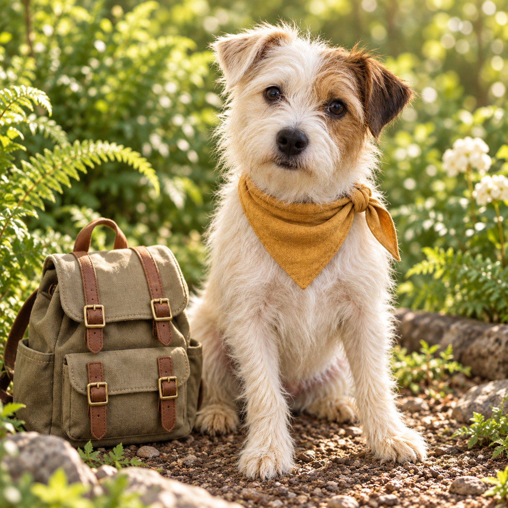](prompts/03-people-pets.md#p014)<br>**[P014 · Pet explorer portrait](prompts/03-people-pets.md#p014)** | [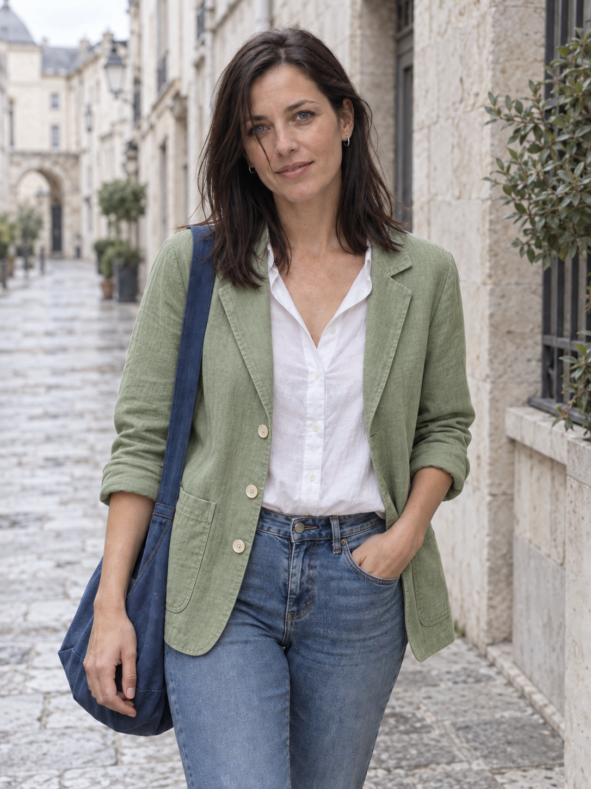](prompts/03-people-pets.md#p015)<br>**[P015 · Linen jacket virtual styling](prompts/03-people-pets.md#p015)** |
| [](prompts/03-people-pets.md#p016)<br>**[P016 · Analog weekend portrait](prompts/03-people-pets.md#p016)** | [](prompts/03-people-pets.md#p017)<br>**[P017 · Couple illustration keepsake](prompts/03-people-pets.md#p017)** | [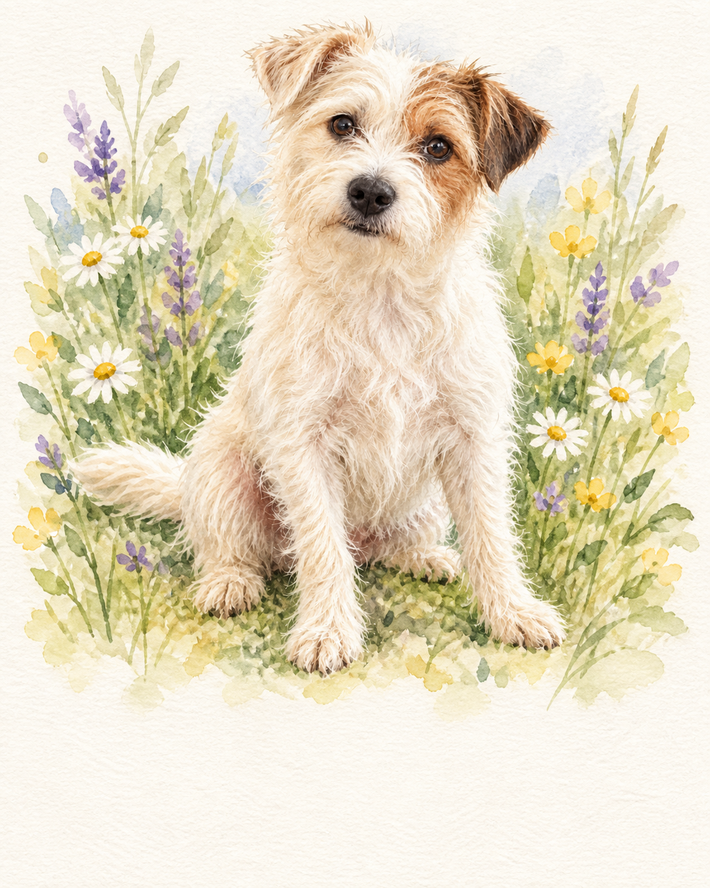](prompts/03-people-pets.md#p018)<br>**[P018 · Pet remembrance watercolor](prompts/03-people-pets.md#p018)** |

**Copy this prompt · P013**

References (upload in order): [1](assets/images/adult-input.png)

```text
Asset: Natural professional portrait. Target aspect ratio: 4:5. Mode: edit.
Image 1 is a consenting adult portrait. Create a relaxed professional headshot near a large north-facing window, with a softly blurred warm-gray studio background and a plain charcoal crew-neck top. Frame from chest upward, eye-level, natural skin texture and a small unforced smile.
Constraints: Preserve identity, age, skin tone, facial proportions, hairstyle and distinctive marks; no beauty reshaping.
Render only explicitly requested image text. Do not add unrelated logos, signatures or captions.
```

**Next edit：** Change only the background to a muted olive studio wall.

**Check the result：** Compare eye spacing, nose, jaw, freckles and hairline to the source.

[All prompts and usage notes in this category](prompts/03-people-pets.md) · [Back to categories](#prompt-library)

<a id="showcase-04-editing"></a>

### Precise edits & multi-turn workflows · 6

| | | |
| --- | --- | --- |
| [](prompts/04-editing.md#p019)<br>**[P019 · Product colorway edit](prompts/04-editing.md#p019)** | [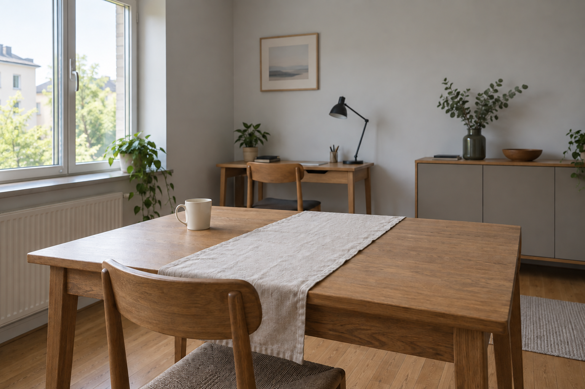](prompts/04-editing.md#p020)<br>**[P020 · Remove a tabletop distraction](prompts/04-editing.md#p020)** | [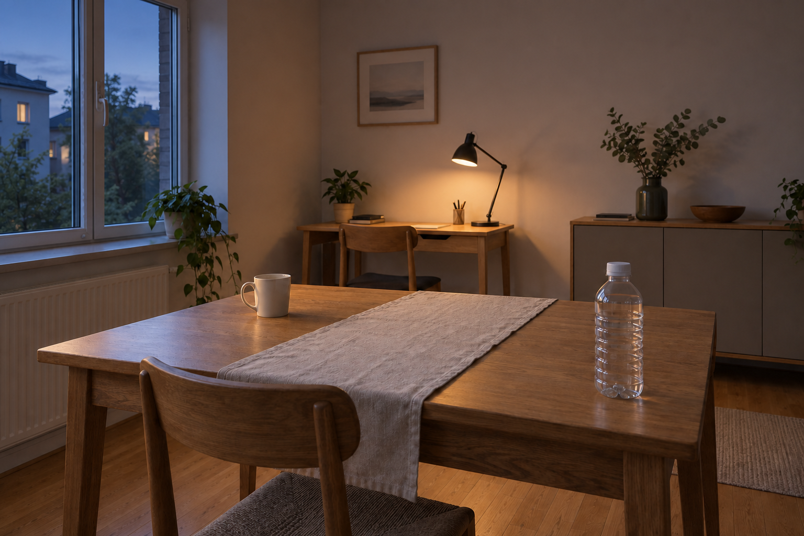](prompts/04-editing.md#p021)<br>**[P021 · Window-light evening relight](prompts/04-editing.md#p021)** |
| [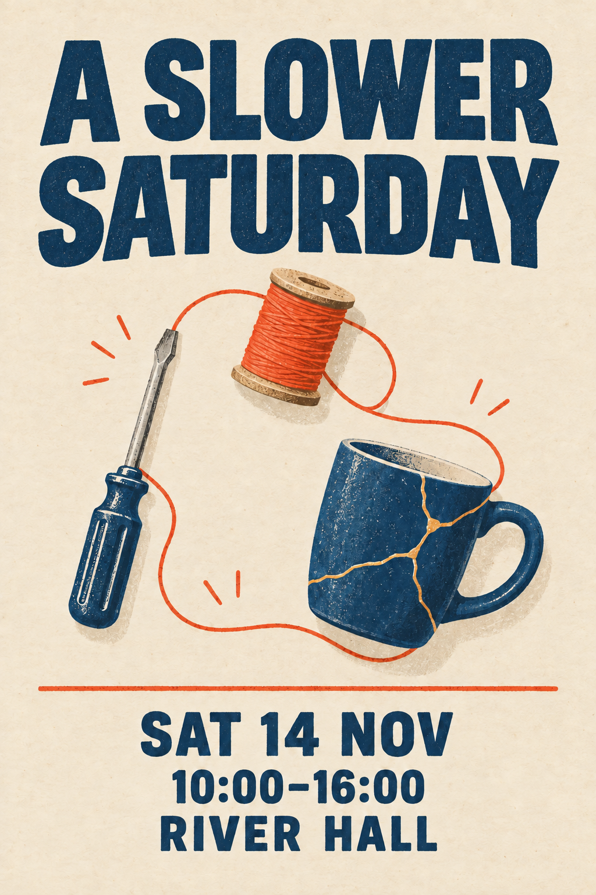](prompts/04-editing.md#p022)<br>**[P022 · Poster text replacement](prompts/04-editing.md#p022)** | [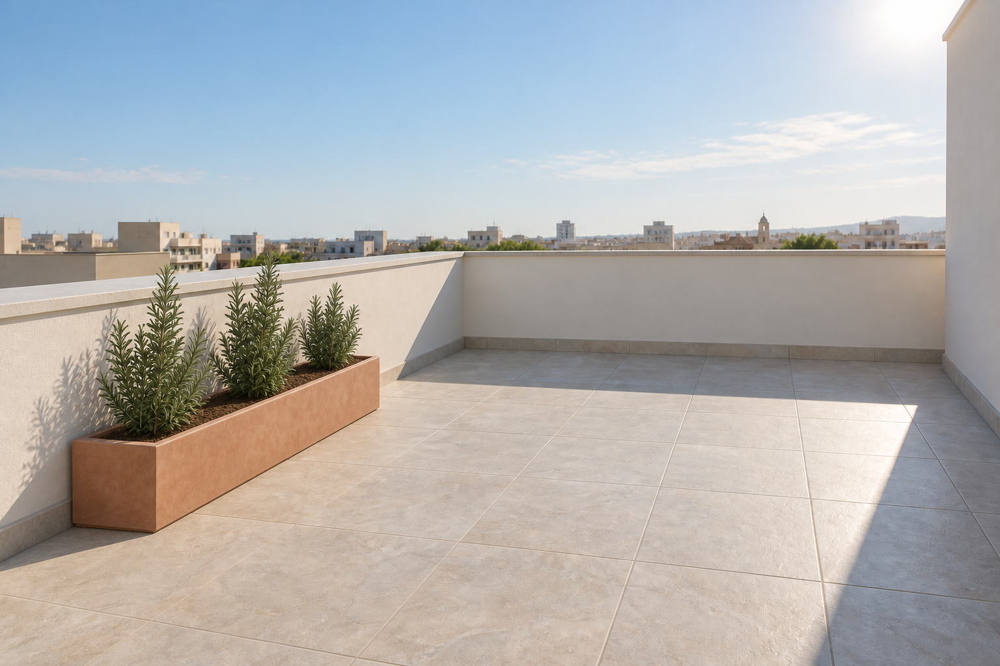](prompts/04-editing.md#p023)<br>**[P023 · Sketch-guided planter placement](prompts/04-editing.md#p023)** | [](prompts/04-editing.md#p024)<br>**[P024 · Clean product cutout](prompts/04-editing.md#p024)** |

**Copy this prompt · P019**

References (upload in order): [1](assets/images/tideline-lamp.png)

```text
Asset: Product colorway edit. Target aspect ratio: 3:2. Mode: edit.
Image 1 is an approved product ad. Change only the lamp’s cylindrical base from midnight blue to muted jade green. Keep the original anodized texture and physically plausible highlight gradient. Do not recolor the ivory shade or orange pull tab. Treat the surrounding campaign as locked artwork.
Constraints: Preserve all copy, positions, scale, camera, background and shadows as closely as possible.
Render only explicitly requested image text. Do not add unrelated logos, signatures or captions.
```

**Next edit：** On this approved green version, change only "LIGHT, UNPLUGGED." to "YOUR EVENING, UPGRADED."; retain green.

**Check the result：** Compare base edges, metal sheen, pull tab and typography across all versions.

[All prompts and usage notes in this category](prompts/04-editing.md) · [Back to categories](#prompt-library)

<a id="showcase-05-information"></a>

### Infographics, education & presentations · 6

| | | |
| --- | --- | --- |
| [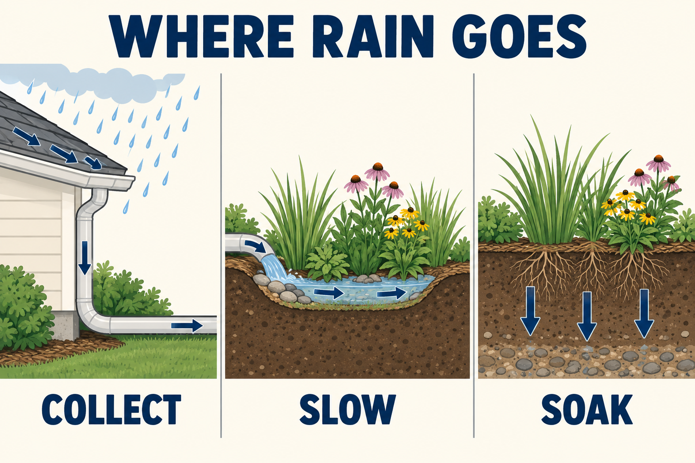](prompts/05-information.md#p025)<br>**[P025 · Three-stage rain garden explainer](prompts/05-information.md#p025)** | [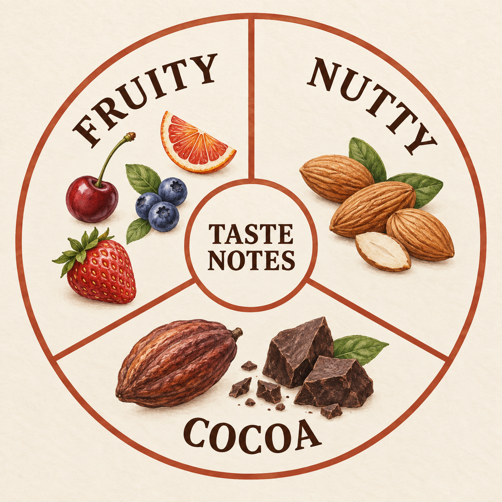](prompts/05-information.md#p026)<br>**[P026 · Coffee tasting wheel for beginners](prompts/05-information.md#p026)** | [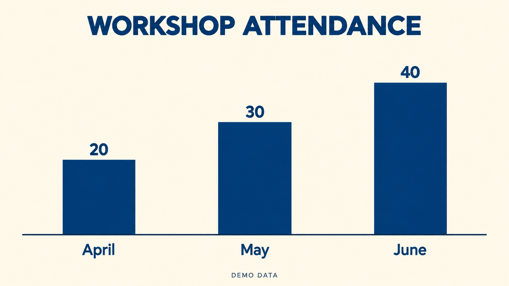](prompts/05-information.md#p027)<br>**[P027 · Transparent demo-data bar chart](prompts/05-information.md#p027)** |
| [](prompts/05-information.md#p028)<br>**[P028 · Fictional neighborhood walking map](prompts/05-information.md#p028)** | [](prompts/05-information.md#p029)<br>**[P029 · Plant life-cycle classroom card](prompts/05-information.md#p029)** | [](prompts/05-information.md#p030)<br>**[P030 · Workshop process slide](prompts/05-information.md#p030)** |

**Copy this prompt · P025**

Input: no reference upload is needed for this default example.

```text
Asset: Three-stage rain garden explainer. Target aspect ratio: 3:2. Mode: generate.
Create a classroom infographic titled "WHERE RAIN GOES". Three equal panels show rain falling on a roof, water entering a planted basin, and water soaking into soil. Exact panel labels: "COLLECT", "SLOW", "SOAK". Use simple cutaway illustrations, navy arrows, cream background and green plants. Leave clear separation between water routes and labels.
Constraints: Do not depict purified drinking water or invent performance percentages.
Render only explicitly requested image text. Do not add unrelated logos, signatures or captions.
```

**Next edit：** Increase only the arrow contrast; keep all stages and wording.

**Check the result：** Check directional flow and whether the soil cross-section communicates infiltration.

[All prompts and usage notes in this category](prompts/05-information.md) · [Back to categories](#prompt-library)

<a id="showcase-06-brand-ui"></a>

### Brand identity & interface concepts · 6

| | | |
| --- | --- | --- |
| [](prompts/06-brand-ui.md#p031)<br>**[P031 · Independent ceramics wordmark](prompts/06-brand-ui.md#p031)**<br>Revised result; steps in recipe | [](prompts/06-brand-ui.md#p032)<br>**[P032 · Museum wayfinding family](prompts/06-brand-ui.md#p032)** | [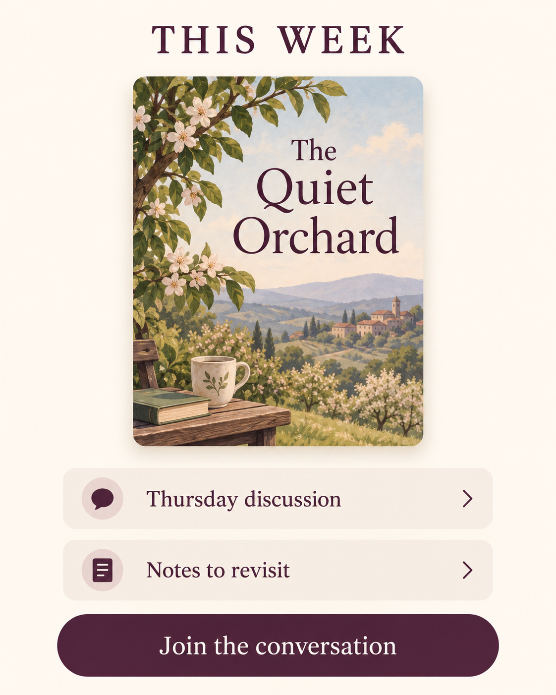](prompts/06-brand-ui.md#p033)<br>**[P033 · Book-club mobile app concept](prompts/06-brand-ui.md#p033)** |
| [](prompts/06-brand-ui.md#p034)<br>**[P034 · Workshop booking landing page](prompts/06-brand-ui.md#p034)** | [](prompts/06-brand-ui.md#p035)<br>**[P035 · Tea packaging family](prompts/06-brand-ui.md#p035)** | [](prompts/06-brand-ui.md#p036)<br>**[P036 · Creator dashboard concept](prompts/06-brand-ui.md#p036)** |

**Copy this prompt · P032**

Input: no reference upload is needed for this default example.

```text
Asset: Museum wayfinding family. Target aspect ratio: 3:2. Mode: generate.
Create a wayfinding concept board for a fictional craft museum. Three matching matte navy signs on cream read "GALLERY →", "WORKSHOP ↑", "CAFÉ ←" in large ivory sans serif. Add a small consistent geometric square symbol to each. Present signs front-on with a narrow material detail strip below.
Constraints: Preserve arrow directions and equal text sizes; no emergency-exit or accessibility certification claims.
Render only explicitly requested image text. Do not add unrelated logos, signatures or captions.
```

**Next edit：** Change only sign material to painted wood while retaining navy and ivory colors.

**Check the result：** Check arrows and legibility; validate physical signage separately.

[All prompts and usage notes in this category](prompts/06-brand-ui.md) · [Back to categories](#prompt-library)

<a id="showcase-07-stories-games"></a>

### Comics, characters & game art · 6

| | | |
| --- | --- | --- |
| [](prompts/07-stories-games.md#p037)<br>**[P037 · Paper moon repair story](prompts/07-stories-games.md#p037)** | [](prompts/07-stories-games.md#p038)<br>**[P038 · Character turnaround sheet](prompts/07-stories-games.md#p038)** | [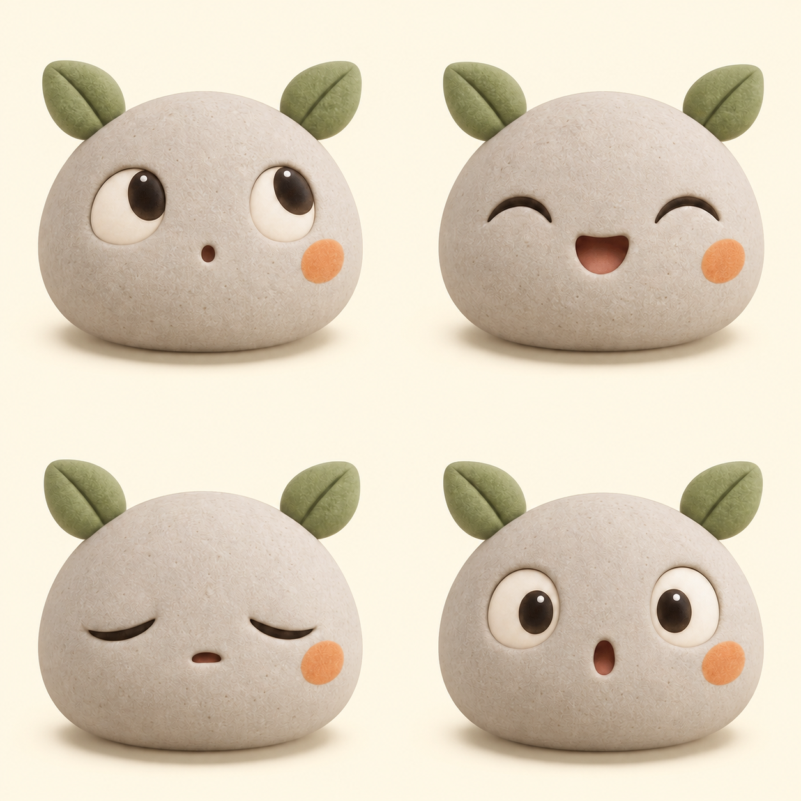](prompts/07-stories-games.md#p039)<br>**[P039 · Four-expression mascot sheet](prompts/07-stories-games.md#p039)** |
| [](prompts/07-stories-games.md#p040)<br>**[P040 · Cozy game inventory icons](prompts/07-stories-games.md#p040)** | [](prompts/07-stories-games.md#p041)<br>**[P041 · Isometric rooftop garden](prompts/07-stories-games.md#p041)** | [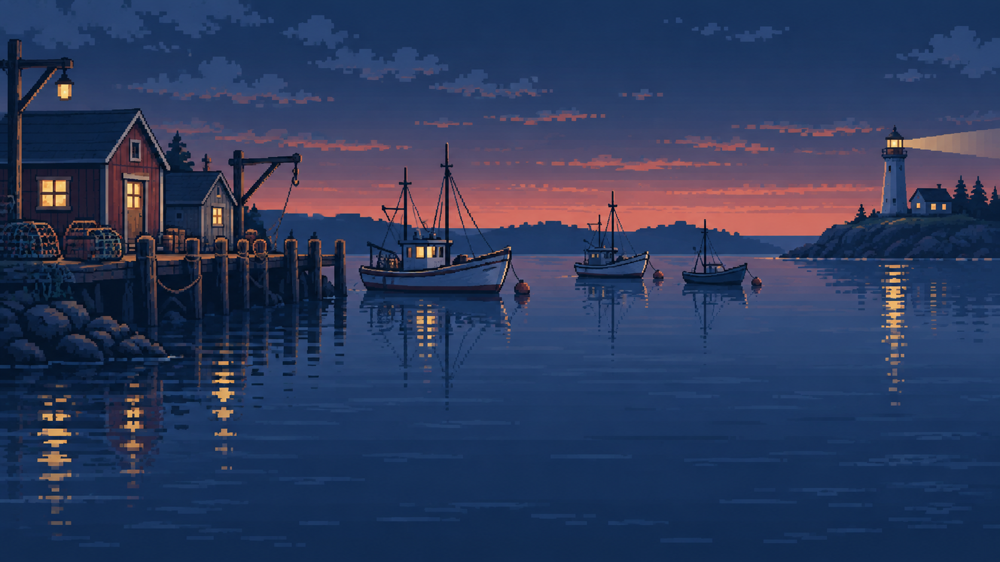](prompts/07-stories-games.md#p042)<br>**[P042 · Pixel-art harbor background](prompts/07-stories-games.md#p042)** |

**Copy this prompt · P037**

Input: no reference upload is needed for this default example.

```text
Asset: Paper moon repair story. Target aspect ratio: 3:2. Mode: generate.
Create a six-panel wordless story in a 3×2 grid. A cream repair robot with one amber eye and teal apron finds a torn paper moon in an attic, lifts its halves, selects orange thread, stitches the seam, hangs the moon, then rests beneath its glow. Use gouache and colored-pencil texture, ivory gutters, warm peach and muted teal with ink-blue dusk.
Constraints: Keep robot design and workshop recognizable across panels; exactly six panels, no dialogue.
Render only explicitly requested image text. Do not add unrelated logos, signatures or captions.
```

**Next edit：** Edit only panel three so the moon is still unstitched while the robot selects the thread.

**Check the result：** Check action order, apron continuity and whether repair happens too early.

[All prompts and usage notes in this category](prompts/07-stories-games.md) · [Back to categories](#prompt-library)

<a id="showcase-08-spaces"></a>

### Architecture, interiors & hospitality · 6

| | | |
| --- | --- | --- |
| [](prompts/08-spaces.md#p043)<br>**[P043 · Workshop-to-reading-room concept](prompts/08-spaces.md#p043)** | [](prompts/08-spaces.md#p044)<br>**[P044 · Small apartment material refresh](prompts/08-spaces.md#p044)** | [](prompts/08-spaces.md#p045)<br>**[P045 · Boutique guest-room styling](prompts/08-spaces.md#p045)** |
| [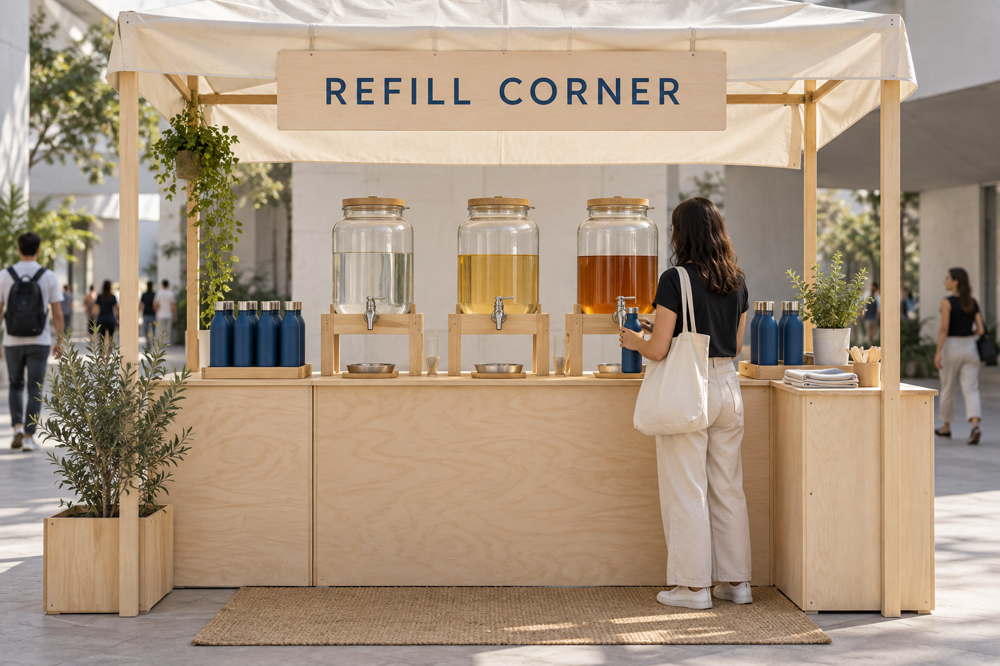](prompts/08-spaces.md#p046)<br>**[P046 · Pop-up refill store](prompts/08-spaces.md#p046)** | [](prompts/08-spaces.md#p047)<br>**[P047 · Courtyard planting concept](prompts/08-spaces.md#p047)** | [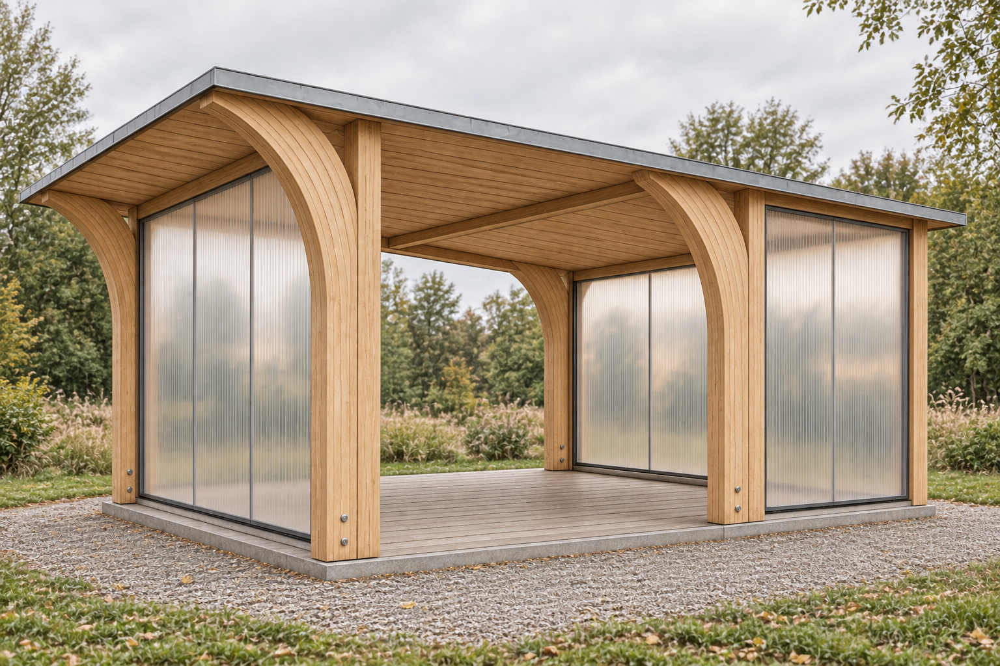](prompts/08-spaces.md#p048)<br>**[P048 · Sketch to small pavilion](prompts/08-spaces.md#p048)** |

**Copy this prompt · P043**

Input: no reference upload is needed for this default example.

```text
Asset: Workshop-to-reading-room concept. Target aspect ratio: 3:2. Mode: generate.
Photograph a compact neighborhood reading room in a former bicycle workshop. Curved terracotta bench left, birch communal table with four chairs center, original steel windows rear, slim bookshelves right, one olive tree by the window. Retain concrete beams and patched terrazzo. Eye-level entrance view, straight verticals, soft morning daylight and visible material grain.
Constraints: No people, logos or signage; preserve believable circulation. Concept, not construction documentation.
Render only explicitly requested image text. Do not add unrelated logos, signatures or captions.
```

**Next edit：** Change only bench upholstery to deep teal; keep architecture and furniture placement.

**Check the result：** Count chairs and inspect walkways, window geometry and table supports.

[All prompts and usage notes in this category](prompts/08-spaces.md) · [Back to categories](#prompt-library)

<a id="showcase-09-publishing"></a>

### Publishing, print & editorial illustration · 6

| | | |
| --- | --- | --- |
| [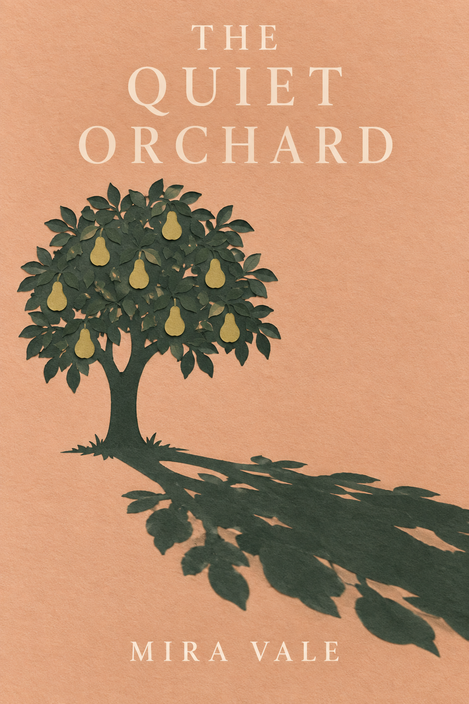](prompts/09-publishing.md#p049)<br>**[P049 · Quiet orchard book cover](prompts/09-publishing.md#p049)** | [](prompts/09-publishing.md#p050)<br>**[P050 · Recipe editorial spread](prompts/09-publishing.md#p050)** | [](prompts/09-publishing.md#p051)<br>**[P051 · Annual review cover](prompts/09-publishing.md#p051)** |
| [](prompts/09-publishing.md#p052)<br>**[P052 · Editorial attention metaphor](prompts/09-publishing.md#p052)** | [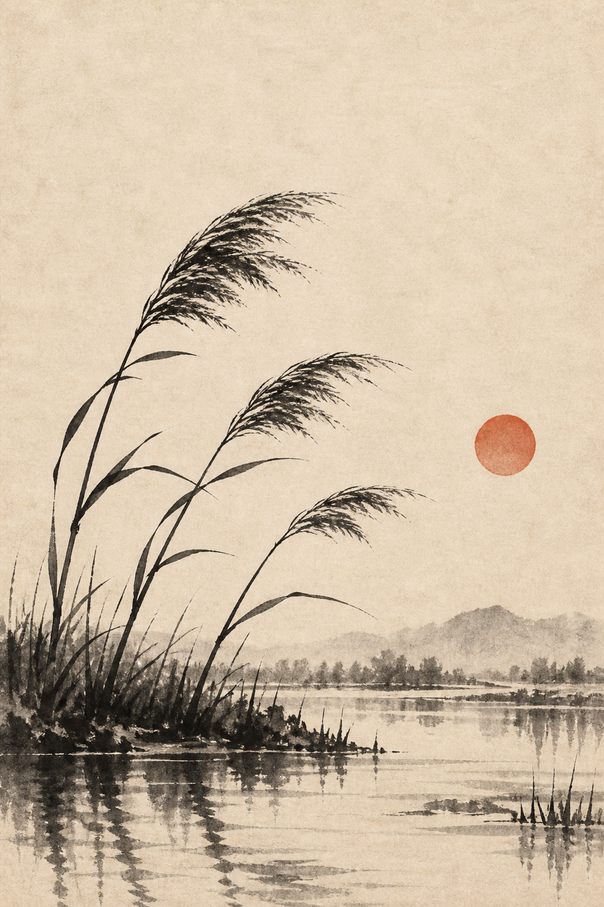](prompts/09-publishing.md#p053)<br>**[P053 · Botanical ink print](prompts/09-publishing.md#p053)** | [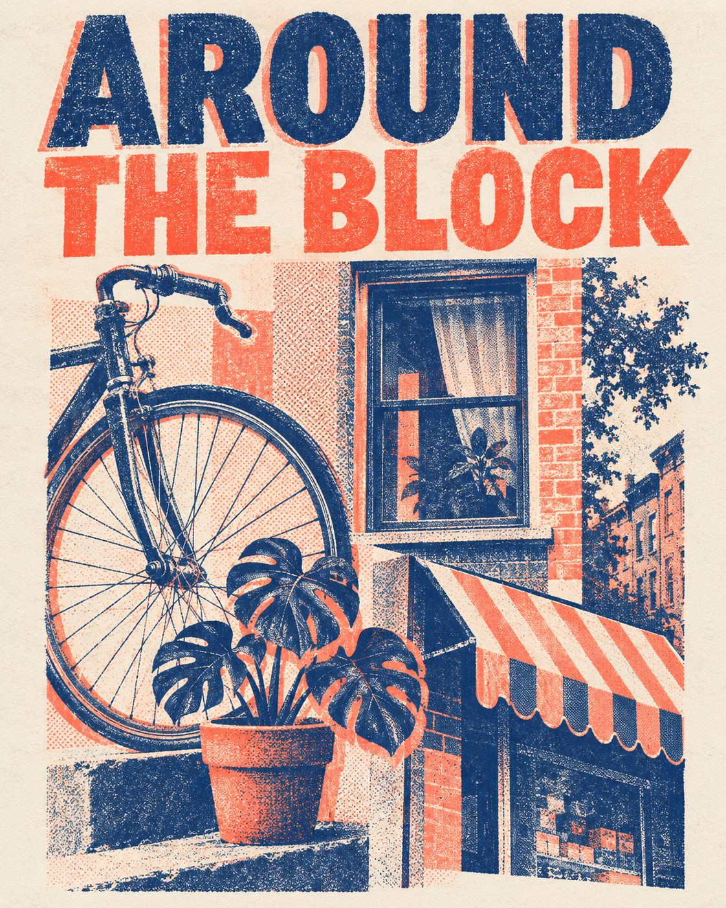](prompts/09-publishing.md#p054)<br>**[P054 · Risograph neighborhood zine](prompts/09-publishing.md#p054)** |

**Copy this prompt · P049**

Input: no reference upload is needed for this default example.

```text
Asset: Quiet orchard book cover. Target aspect ratio: 2:3. Mode: generate.
Design an original literary book cover "THE QUIET ORCHARD" by fictional "MIRA VALE". A single cut-paper pear tree casts an oversized dark-green shadow across pale peach paper. Place the title in restrained cream serif lettering at top and the author at bottom. Flat front-cover artwork, tactile paper grain, no perspective mockup.
Constraints: Only the supplied title and author; no award stickers, quotes, ISBN or publisher logo.
Render only explicitly requested image text. Do not add unrelated logos, signatures or captions.
```

**Next edit：** Increase only title contrast without moving the tree or changing typography.

**Check the result：** Check every title letter and legibility as a thumbnail.

[All prompts and usage notes in this category](prompts/09-publishing.md) · [Back to categories](#prompt-library)

<a id="showcase-10-production"></a>

### Series, localization & production handoff · 6

| | | |
| --- | --- | --- |
| [](prompts/10-production.md#p055)<br>**[P055 · Seasonal product series](prompts/10-production.md#p055)** | [](prompts/10-production.md#p056)<br>**[P056 · Portrait ad reframe](prompts/10-production.md#p056)** | [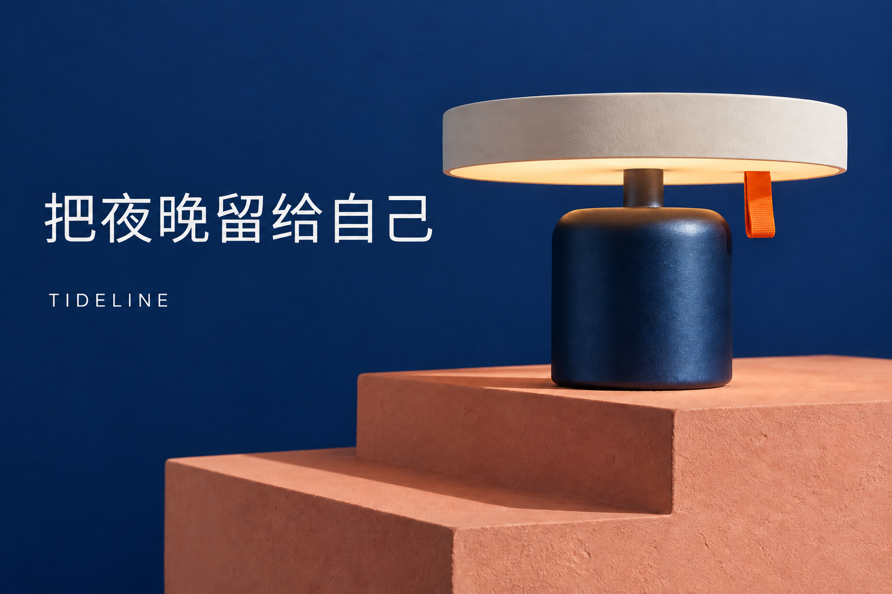](prompts/10-production.md#p057)<br>**[P057 · Localized campaign master](prompts/10-production.md#p057)** |
| [](prompts/10-production.md#p058)<br>**[P058 · Three-reference product composite](prompts/10-production.md#p058)** | [](prompts/10-production.md#p059)<br>**[P059 · Vintage-photo gentle restoration](prompts/10-production.md#p059)** | [](prompts/10-production.md#p060)<br>**[P060 · Approved storyboard shot expansion](prompts/10-production.md#p060)** |

**Copy this prompt · P055**

References (upload in order): [1](assets/images/tideline-lamp.png)

```text
Asset: Seasonal product series. Target aspect ratio: 1:1. Mode: edit.
Use Image 1 as the approved lamp campaign. Produce one autumn variant by changing only background props to two dry maple leaves and a small folded wool cloth. Keep the product, branding, position and camera identical. Match new props to the existing light and reserve the same headline area.
Constraints: One variant per call; do not create a four-image collage or recolor the product.
Render only explicitly requested image text. Do not add unrelated logos, signatures or captions.
```

**Next edit：** For the winter sibling, replace only the autumn props with folded ivory knit; retain lamp and crop.

**Check the result：** Compare product silhouette across seasonal siblings using the approved source.

[All prompts and usage notes in this category](prompts/10-production.md) · [Back to categories](#prompt-library)

<a id="showcase-11-multilingual"></a>

### Multilingual posters · 12

| | | |
| --- | --- | --- |
| [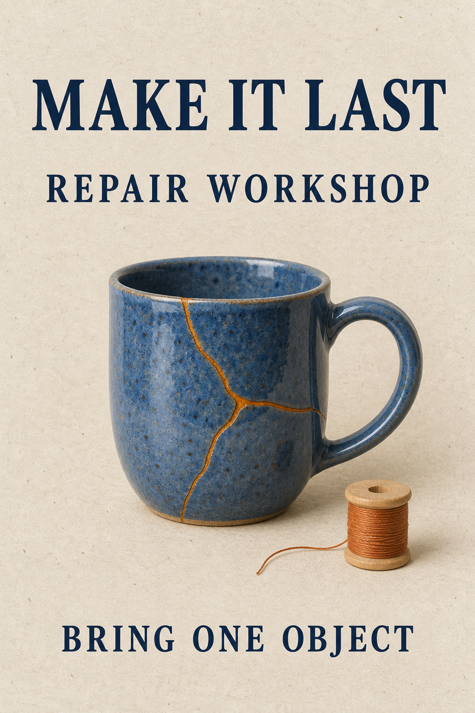](prompts/11-multilingual.md#l001)<br>**[L001 · English · Repair workshop flyer](prompts/11-multilingual.md#l001)** | [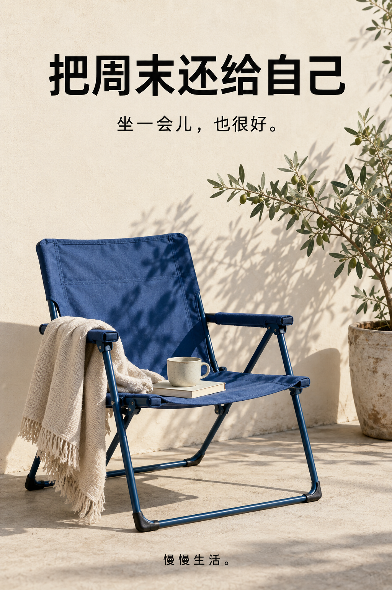](prompts/11-multilingual.md#l002)<br>**[L002 · 简体中文 · 城市慢生活海报](prompts/11-multilingual.md#l002)** | [](prompts/11-multilingual.md#l003)<br>**[L003 · 日本語 · ベーカリーポスター](prompts/11-multilingual.md#l003)** |
| [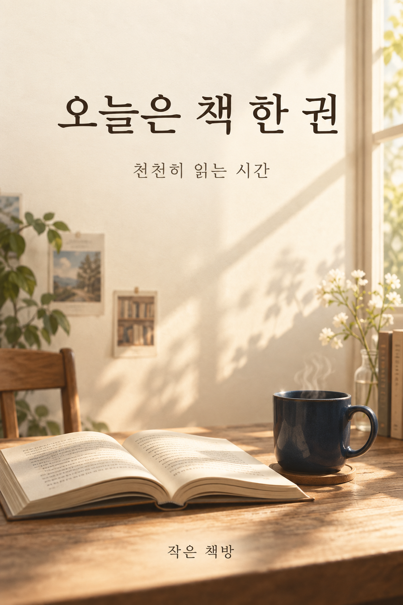](prompts/11-multilingual.md#l004)<br>**[L004 · 한국어 · 독립 서점 포스터](prompts/11-multilingual.md#l004)** | [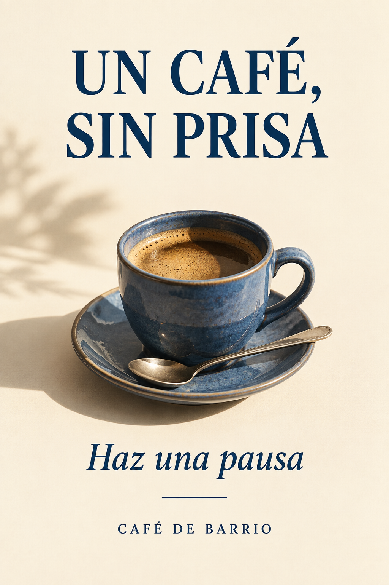](prompts/11-multilingual.md#l005)<br>**[L005 · Español · Cartel de café](prompts/11-multilingual.md#l005)** | [](prompts/11-multilingual.md#l006)<br>**[L006 · Français · Affiche de marché](prompts/11-multilingual.md#l006)** |
| [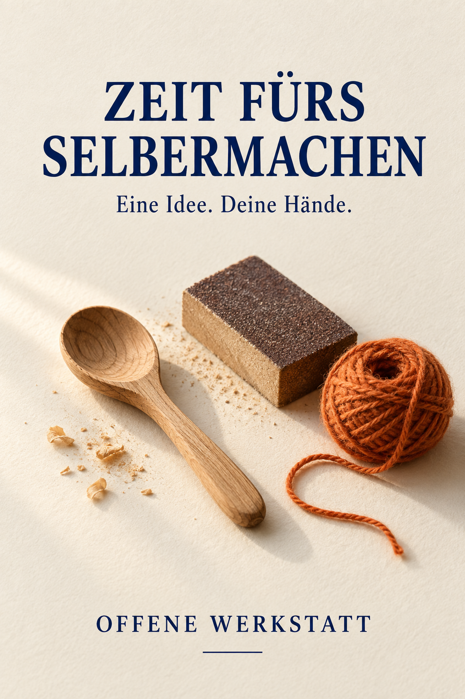](prompts/11-multilingual.md#l007)<br>**[L007 · Deutsch · Werkstattplakat](prompts/11-multilingual.md#l007)** | [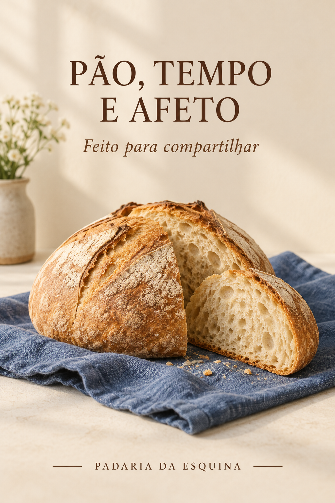](prompts/11-multilingual.md#l008)<br>**[L008 · Português · Cartaz de padaria](prompts/11-multilingual.md#l008)** | [](prompts/11-multilingual.md#l009)<br>**[L009 · العربية · ملصق مقهى](prompts/11-multilingual.md#l009)** |
| [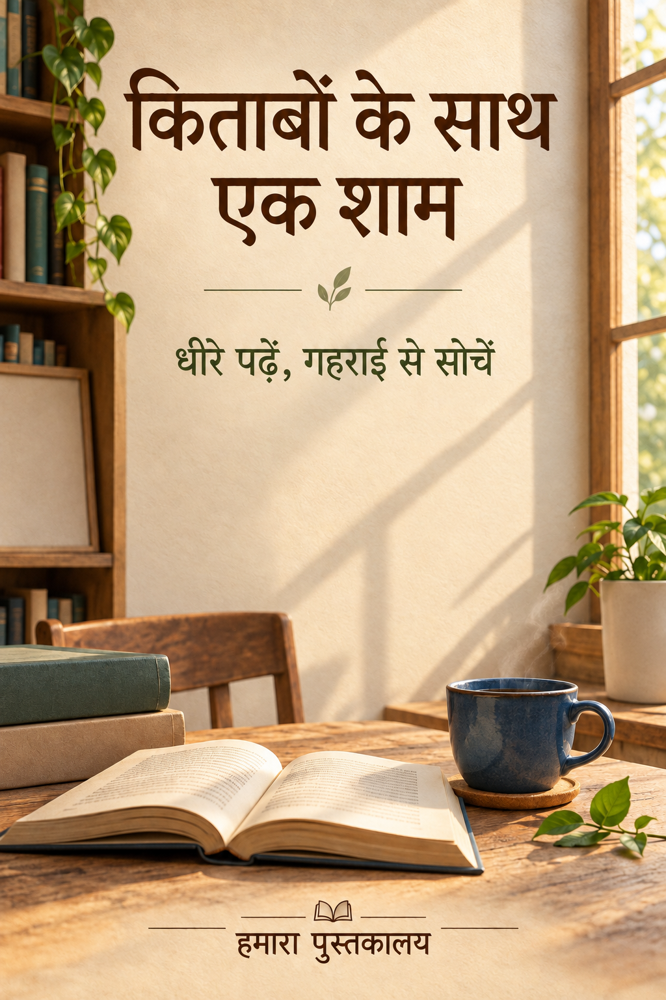](prompts/11-multilingual.md#l010)<br>**[L010 · हिन्दी · पुस्तकालय पोस्टर](prompts/11-multilingual.md#l010)** | [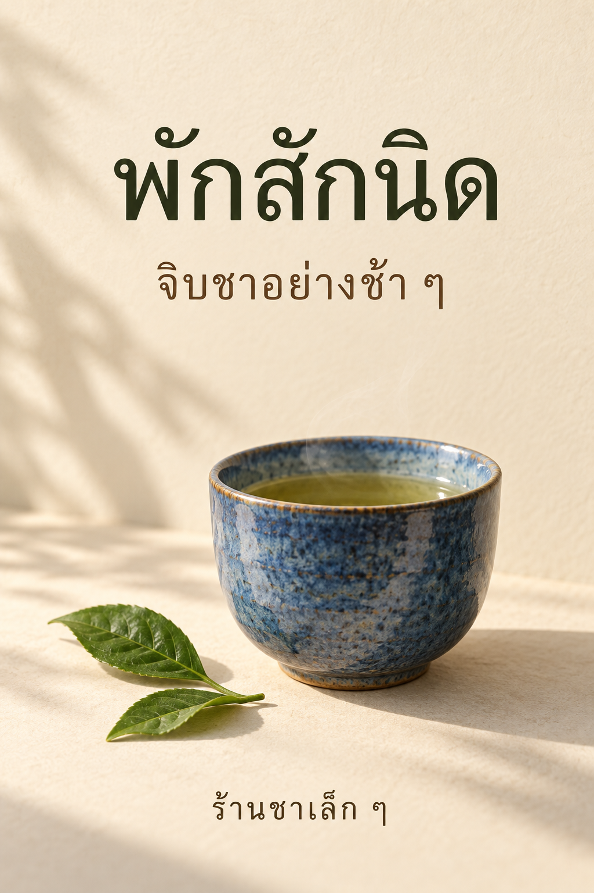](prompts/11-multilingual.md#l011)<br>**[L011 · ไทย · โปสเตอร์ร้านชา](prompts/11-multilingual.md#l011)** | [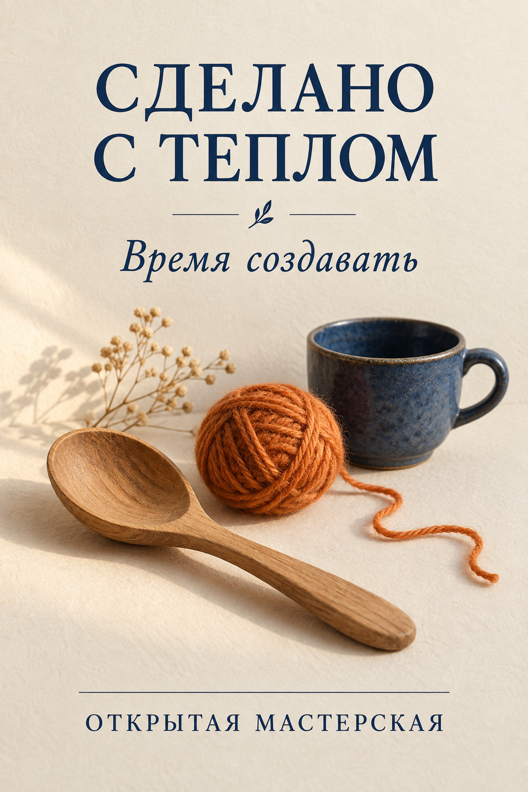](prompts/11-multilingual.md#l012)<br>**[L012 · Русский · Афиша мастерской](prompts/11-multilingual.md#l012)** |

**Copy this prompt · L001**

Input: no reference upload is needed for this default example.

```text
Create a portrait 2:3 flyer for a fictional neighborhood repair workshop. Use cream recycled-paper texture, one blue ceramic mug repaired with a visible orange seam, and a small spool of thread near the bottom. Put exactly "MAKE IT LAST" at the top, "REPAIR WORKSHOP" underneath, and "BRING ONE OBJECT" at the bottom. Use dark navy type with generous line spacing, wide margins and no extra words. Keep the mug fully visible and its handle intact.
```

**Next edit：** Follow-up: change only the bottom line to "START WITH ONE REPAIR"; preserve the illustration, color palette and headline.

**Check the result：** Check all three text strings and avoid invented event details.

[All prompts and usage notes in this category](prompts/11-multilingual.md) · [Back to categories](#prompt-library)

<a id="showcase-12-launch-examples"></a>

### Launch-inspired editing examples · 7

| | | |
| --- | --- | --- |
| [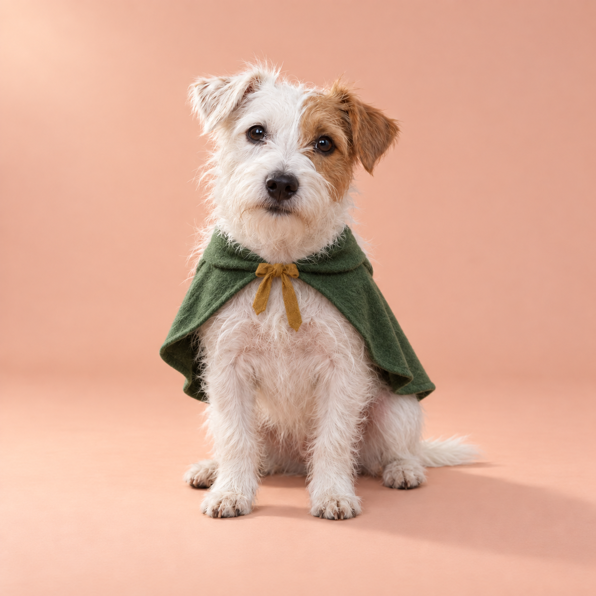](prompts/12-launch-examples.md#p061)<br>**[P061 · Terrier cape makeover](prompts/12-launch-examples.md#p061)** | [](prompts/12-launch-examples.md#p062)<br>**[P062 · Synthetic child portrait wardrobe edit](prompts/12-launch-examples.md#p062)** | [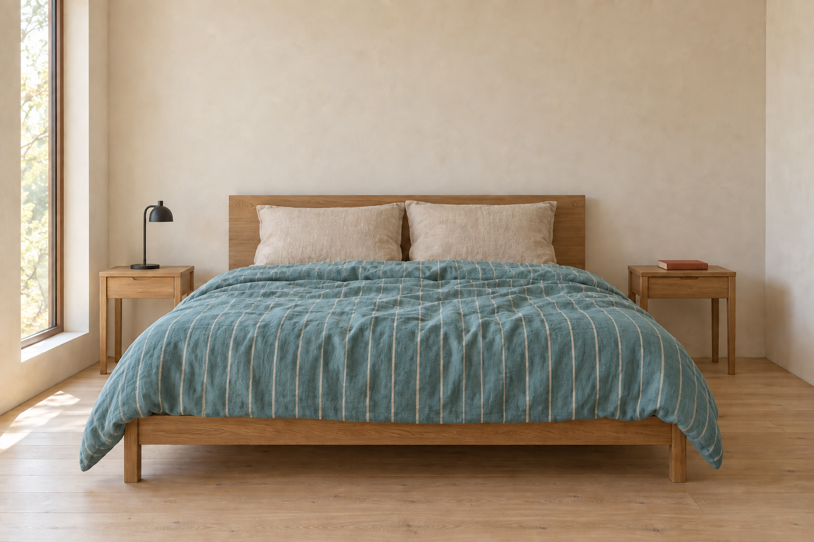](prompts/12-launch-examples.md#p063)<br>**[P063 · Duvet pattern swap](prompts/12-launch-examples.md#p063)** |
| [](prompts/12-launch-examples.md#p064)<br>**[P064 · Souvenir city-name replacement](prompts/12-launch-examples.md#p064)** | [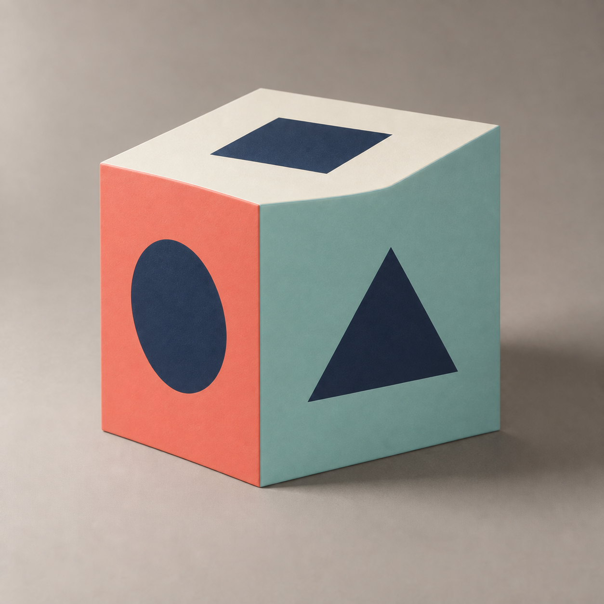](prompts/12-launch-examples.md#p065)<br>**[P065 · Symbol-marked cube rotation](prompts/12-launch-examples.md#p065)** | [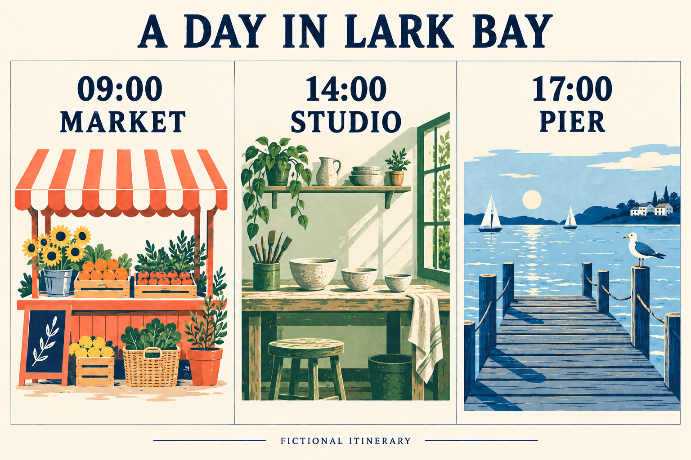](prompts/12-launch-examples.md#p066)<br>**[P066 · One-column itinerary revision](prompts/12-launch-examples.md#p066)** |
| [](prompts/12-launch-examples.md#p067)<br>**[P067 · Birthday candle count edit](prompts/12-launch-examples.md#p067)** |  |  |

**Copy this prompt · P061**

References (upload in order): [1](assets/images/launch-dog-input.png)

```text
Asset: Terrier cape makeover. Target aspect ratio: 1:1. Mode: edit.
Edit the supplied terrier photo. Add only a soft forest-green cape resting over its shoulders and upper back, with one small ochre fabric tie at the chest. Keep the head and ears completely uncovered. Preserve the exact dog identity, eye color, caramel coat patches and their sides as actually shown in the input, muzzle, shaggy fur, seated pose, paws, tail, peach backdrop, floor shadow and framing. Cape must drape naturally without changing anatomy. No hat, no extra accessories, no words. Same square canvas.
Constraints: Attach the input image shown above, not both before/after images. Make only the requested change; inspect every preserved region.
Render only explicitly requested image text. Do not add unrelated logos, signatures or captions.
```

**Next edit：** Change only the cape fabric to burgundy. Keep the tie ochre and preserve the dog.

**Check the result：** Green cape and tie added; eye patch, ears and paws remain recognizable. Fine fur detail changes.

[All prompts and usage notes in this category](prompts/12-launch-examples.md) · [Back to categories](#prompt-library)

<a id="showcase-13-customizable-studio"></a>

### Customizable studio briefs · 6

| | | |
| --- | --- | --- |
| [](prompts/13-customizable-studio.md#p068)<br>**[P068 · Repair collective editorial portrait](prompts/13-customizable-studio.md#p068)** | [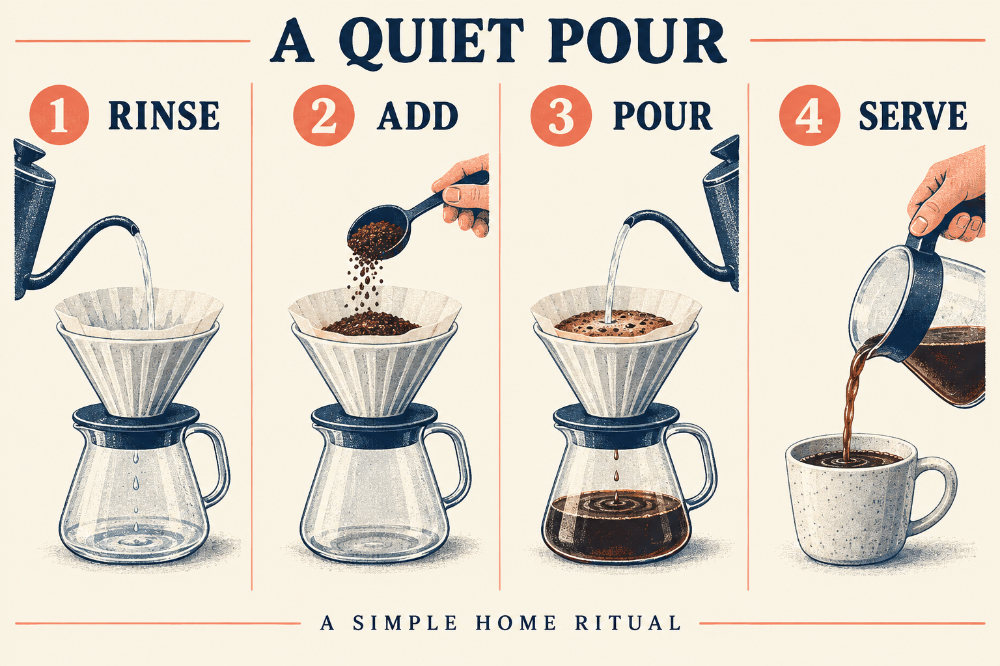](prompts/13-customizable-studio.md#p069)<br>**[P069 · Four-step pour-over poster](prompts/13-customizable-studio.md#p069)** | [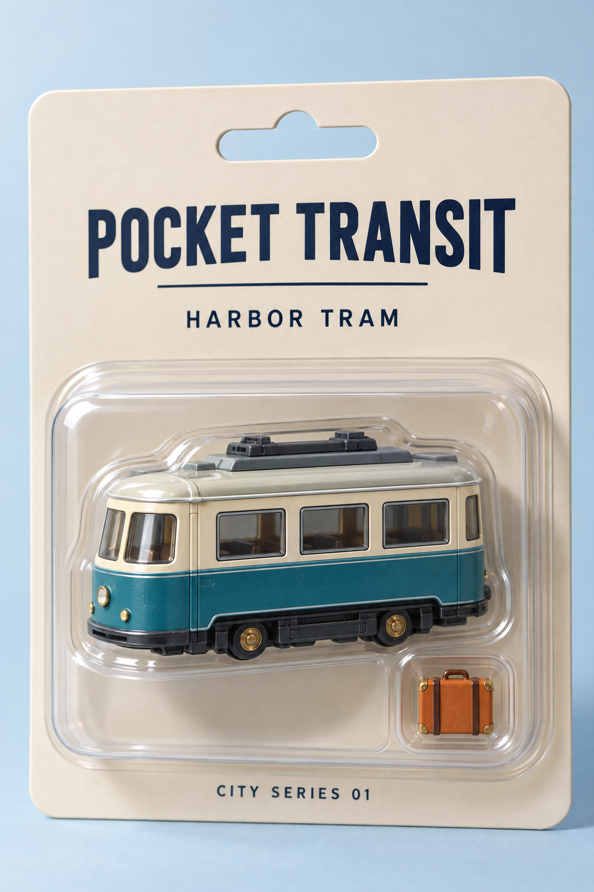](prompts/13-customizable-studio.md#p070)<br>**[P070 · Pocket tram collectible packaging](prompts/13-customizable-studio.md#p070)** |
| [](prompts/13-customizable-studio.md#p071)<br>**[P071 · Handmade lighthouse island](prompts/13-customizable-studio.md#p071)** | [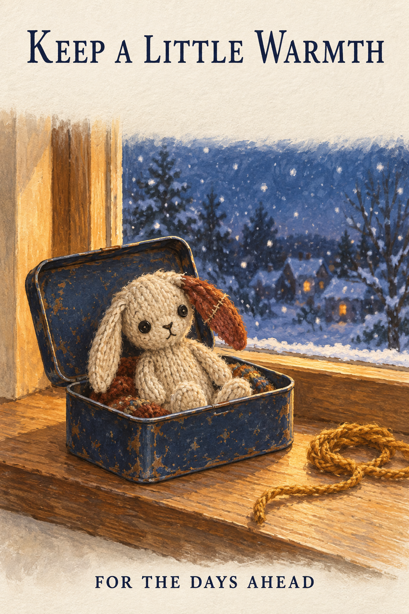](prompts/13-customizable-studio.md#p072)<br>**[P072 · Knitted keepsake greeting card](prompts/13-customizable-studio.md#p072)** | [](prompts/13-customizable-studio.md#p073)<br>**[P073 · Ceramics studio editorial collage](prompts/13-customizable-studio.md#p073)** |

**Copy this prompt · P068**

Input: no reference upload is needed for this default example.

```text
Asset: Repair collective editorial portrait. Target aspect ratio: 3:2. Mode: generate.
Create a landscape 3:2 editorial photograph for a fictional neighborhood repair collective. An adult woman in her late fifties with short silver curls and a mustard canvas apron sits at a scarred birch workbench, carefully hand-stitching the torn seam of a navy canvas backpack. Three-quarter view at bench height, hands and needle visible but not exaggerated. A spool of cream thread, blunt scissors and one desk lamp sit on the bench. Soft overcast daylight enters a large window on the left; faded sage walls and an orderly pegboard recede softly behind her. Honest skin texture, frayed canvas fibers, subdued colors, slight photographic grain. The scene is staged fiction, not a historical photograph. Keep the subject on the right with quiet space at upper left for later editorial copy. No text, labels, logos, signatures, extra people or glamor retouching.
Constraints: Keep believable hand contact and a visible repair seam; no text or additional people.
Render only explicitly requested image text. Do not add unrelated logos, signatures or captions.
```

**Next edit：** Change only the apron from mustard to muted plum. Preserve the person, pose, backpack, tools, lighting and framing.

**Check the result：** Subject, backpack seam and window light match the brief. Extra bowl and cloth appear on the foreground workbench; fingers and needle contact need close production review.

[All prompts and usage notes in this category](prompts/13-customizable-studio.md) · [Back to categories](#prompt-library)

<a id="showcase-14-sketch-to-story"></a>

### Sketch-to-story: English workflow prompts · 12

| | | |
| --- | --- | --- |
| [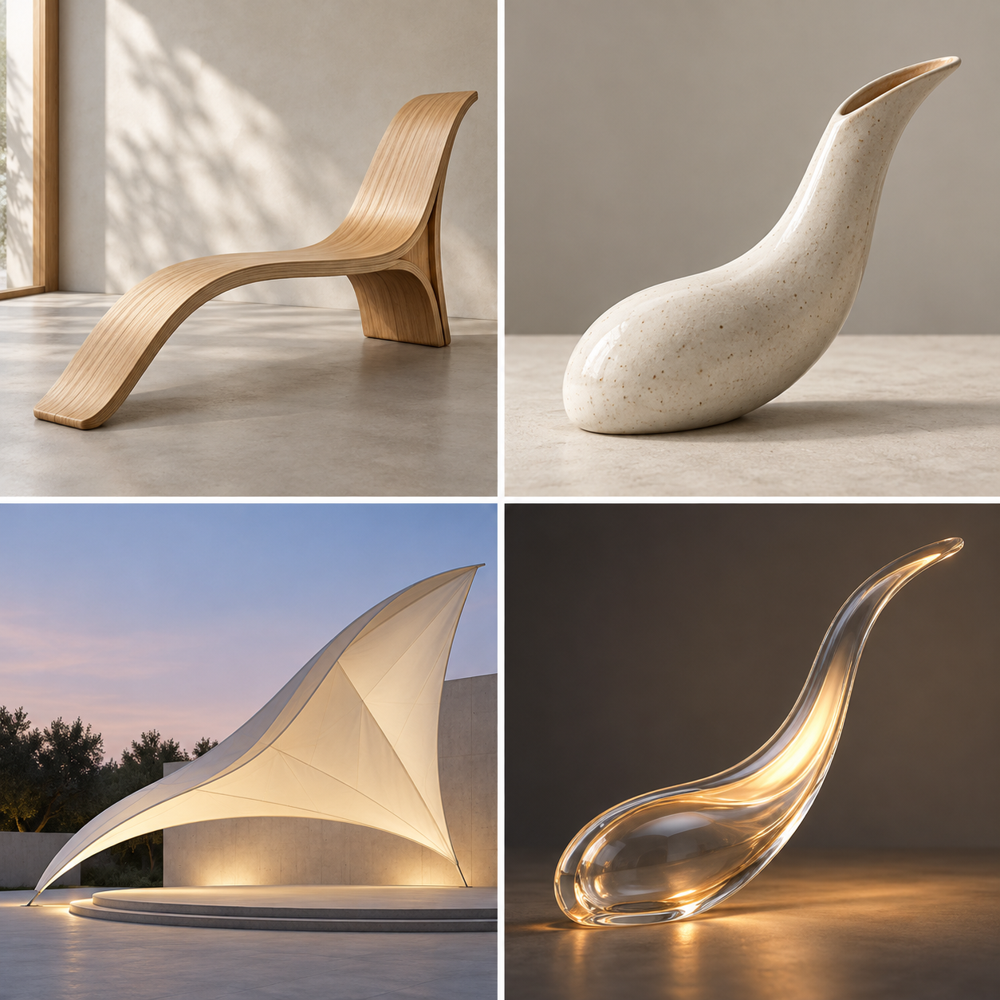](prompts/14-sketch-to-story.md#p074)<br>**[P074 · One sketch, four concept directions](prompts/14-sketch-to-story.md#p074)** | [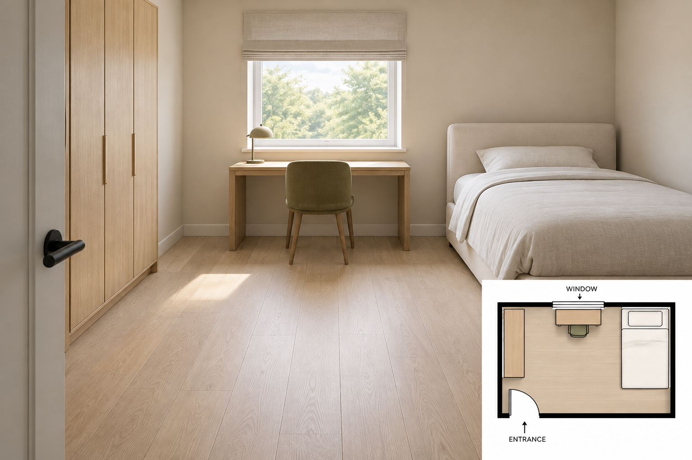](prompts/14-sketch-to-story.md#p075)<br>**[P075 · Bedroom plan to interior concept](prompts/14-sketch-to-story.md#p075)** | [](prompts/14-sketch-to-story.md#p076)<br>**[P076 · Doodle character across four media](prompts/14-sketch-to-story.md#p076)** |
| [](prompts/14-sketch-to-story.md#p077)<br>**[P077 · English tea collection editorial sheet](prompts/14-sketch-to-story.md#p077)** | [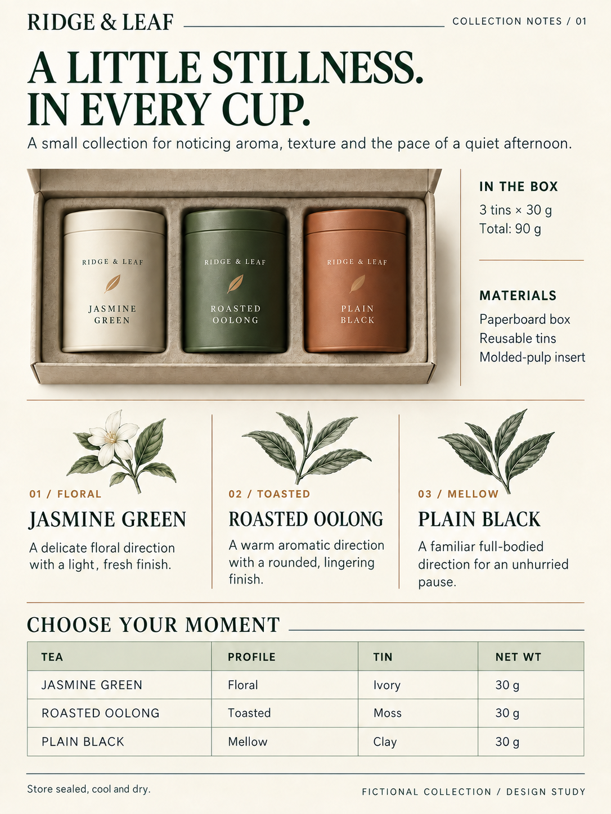](prompts/14-sketch-to-story.md#p078)<br>**[P078 · Headline replacement without layout drift](prompts/14-sketch-to-story.md#p078)** | [](prompts/14-sketch-to-story.md#p079)<br>**[P079 · Four-region portrait correction brief](prompts/14-sketch-to-story.md#p079)** |
| [](prompts/14-sketch-to-story.md#p080)<br>**[P080 · Portrait continuity through three revisions](prompts/14-sketch-to-story.md#p080)** | [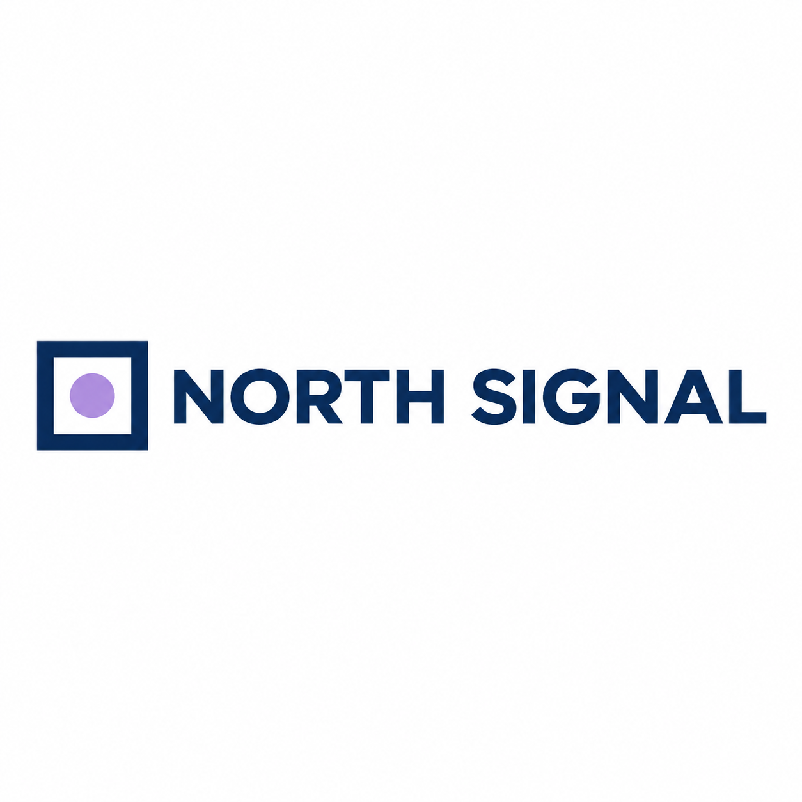](prompts/14-sketch-to-story.md#p081)<br>**[P081 · Logo redesign with an explicit brand brief](prompts/14-sketch-to-story.md#p081)** | [](prompts/14-sketch-to-story.md#p082)<br>**[P082 · Reference-led branded apparel presentation](prompts/14-sketch-to-story.md#p082)** |
| [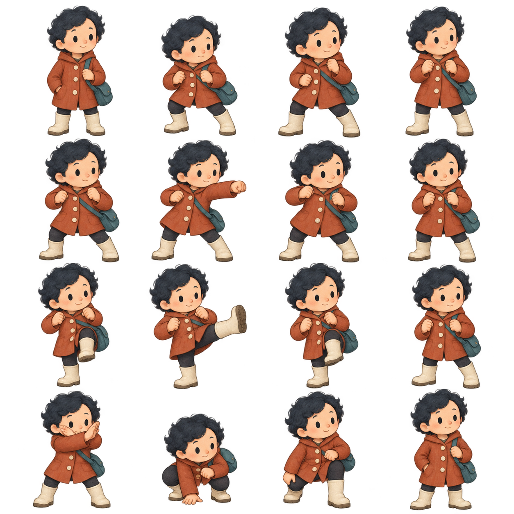](prompts/14-sketch-to-story.md#p083)<br>**[P083 · Sixteen-pose action reference sheet](prompts/14-sketch-to-story.md#p083)** | [](prompts/14-sketch-to-story.md#p084)<br>**[P084 · Nine-shot music-video concept board](prompts/14-sketch-to-story.md#p084)** | [](prompts/14-sketch-to-story.md#p085)<br>**[P085 · Sixteen-shot two-character narrative board](prompts/14-sketch-to-story.md#p085)** |

**Copy this prompt · P074**

References (upload in order): [1](assets/images/curve-input.png)

```text
Asset: One sketch, four concept directions. Target aspect ratio: 1:1. Mode: edit.
Use the attached line sketch as a silhouette and composition reference. Create one square concept board with exactly four equal panels in a 2-by-2 grid. Keep the sketch's dominant curve recognizable in every panel, including its direction, major bend and approximate position; the stroke is a shape guide, not an object to print on top. Interpret it as four distinct concepts: upper left, a bent-plywood reading bench; upper right, a ceramic pouring vessel; lower left, a folded-paper stage canopy; lower right, a luminous glass sculpture. Give each panel one primary object, a quiet environment and lighting appropriate to its material. Maintain equal gutters and similar object scale so the alternatives can be compared. Do not add captions, arrows, extra panels or unrelated decorative marks. These are four explorations, not four views of one design.
Constraints: Attach one sketch you own. Preserve its distinctive bend without forcing identical materials. Generate each selected panel separately for final production.
Render only explicitly requested image text. Do not add unrelated logos, signatures or captions.
```

**Next edit：** Develop only the upper-left bench concept into one landscape image. Preserve the approved bent silhouette; replace the background with a quiet library interior.

**Check the result：** Count four panels; trace the original curve in each; check that all four object categories differ.

[All prompts and usage notes in this category](prompts/14-sketch-to-story.md) · [Back to categories](#prompt-library)

<a id="showcase-15-x-community"></a>

### X community: practical visual briefs · 6

| | | |
| --- | --- | --- |
| [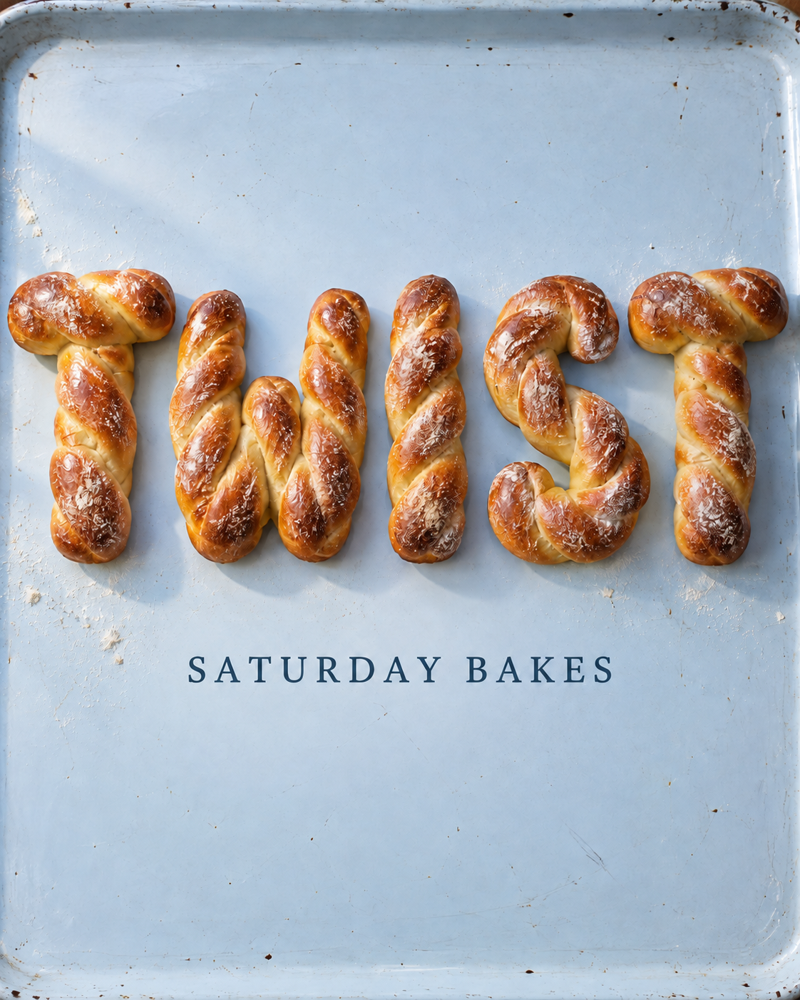](prompts/15-x-community.md#p086)<br>**[P086 · Ingredient-built bakery lettering](prompts/15-x-community.md#p086)**<br>Revised result; steps in recipe | [](prompts/15-x-community.md#p087)<br>**[P087 · Six-frame fragrance launch board](prompts/15-x-community.md#p087)** | [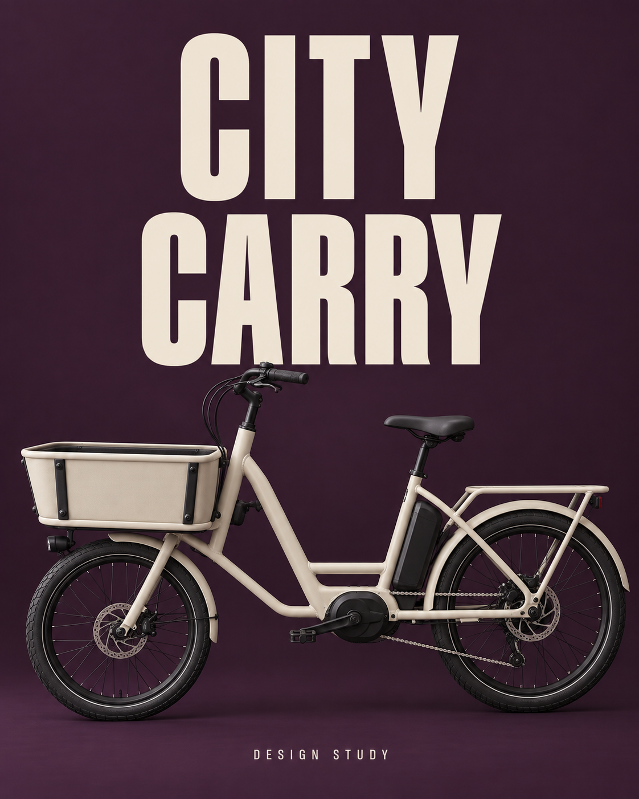](prompts/15-x-community.md#p088)<br>**[P088 · Editorial mobility concept poster](prompts/15-x-community.md#p088)** |
| [](prompts/15-x-community.md#p089)<br>**[P089 · Paper-window weekend destination card](prompts/15-x-community.md#p089)** | [](prompts/15-x-community.md#p090)<br>**[P090 · Sketch-to-building concept reveal](prompts/15-x-community.md#p090)** | [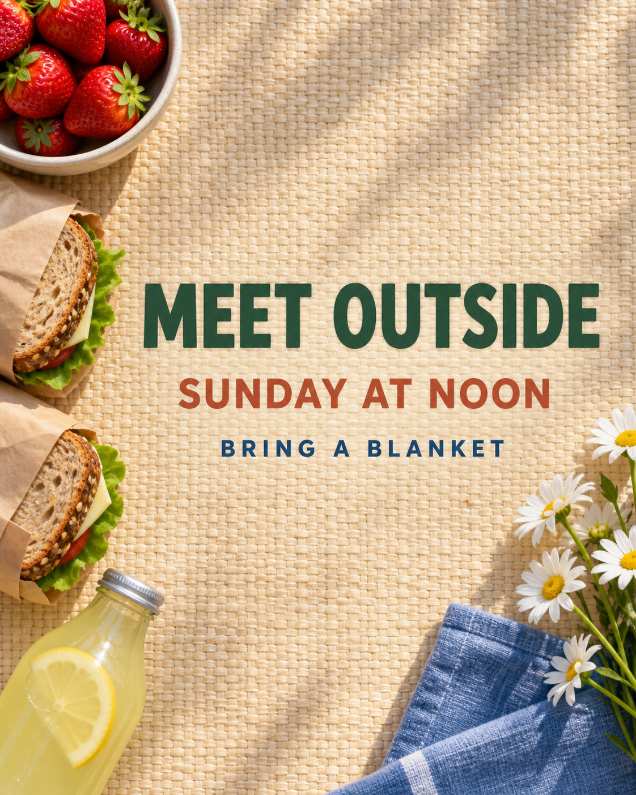](prompts/15-x-community.md#p091)<br>**[P091 · Community picnic announcement](prompts/15-x-community.md#p091)** |

**Copy this prompt · P087**

Input: no reference upload is needed for this default example.

```text
Asset: Six-frame fragrance launch board. Target aspect ratio: 3:2. Mode: generate.
Create a static six-panel presentation board for a fictional cedar fragrance named NORTH ROOM. Use a precise three-column, two-row grid on warm gray paper. The product is a squat amber rectangular glass bottle with a brushed silver cylindrical cap and an ivory NORTH ROOM label. Read left to right: full bottle on slate; close-up of the cap seam; side light through amber liquid; uncapped bottle with the cap resting beside it; atomizer releasing a fine mist; final bottle beside a small cedar block. Number the frames 01 through 06 in identical outside gutters. Keep the same bottle geometry and studio surface throughout.
Constraints: A single still image, not a video or GIF. Six panels only. No floating cap, invented performance claims or additional text.
Render only explicitly requested image text. Do not add unrelated logos, signatures or captions.
```

**Next edit：** Correct only panel 05 so the mist originates at the atomizer; preserve all other panels and gutters.

**Check the result：** Count six frames, compare caps and labels, inspect mist origin. Animation and sound require a separate production step.

[All prompts and usage notes in this category](prompts/15-x-community.md) · [Back to categories](#prompt-library)

<a id="showcase-16-videoweb-x-creators"></a>

### VideoWeb creator briefs from X · 3

| | | |
| --- | --- | --- |
| [](prompts/16-videoweb-x-creators.md#p092)<br>**[P092 · Fashion-film wardrobe concept](prompts/16-videoweb-x-creators.md#p092)** | [](prompts/16-videoweb-x-creators.md#p093)<br>**[P093 · Retro short-film opening frame](prompts/16-videoweb-x-creators.md#p093)** | [](prompts/16-videoweb-x-creators.md#p094)<br>**[P094 · Headphone launch key visual](prompts/16-videoweb-x-creators.md#p094)** |

**Copy this prompt · P092**

Input: no reference upload is needed for this default example.

```text
Asset: Fashion-film wardrobe concept. Target aspect ratio: 3:4. Mode: generate.
Create a vertical 3:4 wardrobe concept for a fictional fashion film. Show one adult model in a teal cropped rain jacket, ivory wide-leg trousers and dark ankle boots, full body with both feet visible. Use expressive ink contours and restrained watercolor washes on warm white paper. Keep the silhouette clearly readable, with generous blank space above the head for a title added later. The model faces three-quarters left with relaxed hands; show the jacket closure and pockets clearly. This is a costume design illustration, not a photo of a real person.
Constraints: No lettering, logos or additional figures. Do not crop feet or hide garment construction.
Render only explicitly requested image text. Do not add unrelated logos, signatures or captions.
```

**Next edit：** Change only the rain jacket to ochre yellow. Preserve the pose, face, trousers, boots, ink style and blank title area.

**Check the result：** Check silhouette, anatomy or product geometry, usable title space and visual consistency. Follow-up and motion suggestions have not been executed.

[All prompts and usage notes in this category](prompts/16-videoweb-x-creators.md) · [Back to categories](#prompt-library)

<!-- END GENERATED SHOWCASE -->

## New for VideoWeb creators

| Wardrobe concept | Retro opening frame | Product reveal frame |
| --- | --- | --- |
| [](prompts/16-videoweb-x-creators.md#p092) | [](prompts/16-videoweb-x-creators.md#p093) | [](prompts/16-videoweb-x-creators.md#p094) |

[Three new bilingual X-inspired recipes](prompts/16-videoweb-x-creators.md) · [Video demonstrations](docs/video-guide.md) · [Still-to-video workflow](docs/videoweb-workflow.md)

The original 103 recipes remain available. These three additions are our own expanded briefs, with credited X references and separately generated examples. Their source posts were checked through public mirrors because native X required login. The retro frame has extra wall decorations; its review explains the limitation.

## Why this prompt library exists

A useful prompt says what the image must accomplish, which details can change, and what must survive the next edit. This collection turns everyday creative jobs into concrete briefs with composition, materials, exact copy, constraints, follow-up edits and review criteria.

**106 recipes across 16 packs:** 76 recipes with complete English and Simplified Chinese prompts, 18 English-only workflow recipes, and 12 language-specific briefs. **Every recipe now has a generated example.** The 143 PNGs (139 inherited from Flaq AI, plus four VideoWeb additions) include results, synthetic editing inputs, revision attempts and the cover. Browse the [visual gallery](docs/gallery.md) to choose a look, then open its complete prompt and review notes. Translations and follow-up edits are not counted as extra recipes.

The library is for independent brands, online shops, designers, creators, educators and small production teams. Start with a lamp campaign, repair a poster headline, preserve a pet’s distinctive features, or build a consistent illustrated story.

## What changes with Images 2.5?

The official documentation distinguishes **GPT Image 2.5 Flare** for fast everyday generation and **GPT Image 2.5 Sunburst** for workflows where editing precision matters most. Both accept text and image inputs. See the official [Flare model page](https://developers.openai.com/api/docs/models/gpt-image-2.5-flare) and [Sunburst model page](https://developers.openai.com/api/docs/models/gpt-image-2.5-sunburst).

Our practical response is to include an explicit preserve list, an approved-image workflow and a focused revision for every core recipe. These are editorial recommendations, not measured success rates. The [version notes](docs/model-notes.md) separate documented capabilities from untested assumptions.

Explore the [Image 2 vs Images 2.5 comparison](docs/images-2-vs-2-5.md) and [10 practical creative workflows](docs/playbook.md) to choose a starting point.

## Featured examples

| Product campaign | Japanese bakery poster |
| --- | --- |
|  |  |
| [P001 · Product brief](prompts/01-product.md#p001) | [L003 · Japanese brief](prompts/11-multilingual.md#l003) |

| Wordless story | Architectural concept |
| --- | --- |
|  |  |
| [P037 · Story brief](prompts/07-stories-games.md#p037) | [P043 · Interior brief](prompts/08-spaces.md#p043) |

These images were generated for this repository using Codex’s built-in image tool. Its underlying model ID was not returned, so they are **not verified Flare or Sunburst benchmarks**. The story has a visible continuity issue in panel three; the room contains extra styling objects. Read the [honest review notes](docs/generation-log.md) before using an example as a production reference.

## New: from a Chinese walkthrough to English workflows

Twelve English recipes, **P074–P085**, cover sketch exploration, layout-guided interiors, character styles, a detailed tea editorial page, precise text edits, portrait continuity, logo and apparel concepts, and 9- or 16-panel storyboards.

Each includes input requirements, a complete English prompt, a customization suggestion, a follow-up and review criteria. Each now includes a generated demonstration using new fictional copy and scenarios, with linked editing inputs where needed. The [source-to-recipe guide](docs/sketch-to-story.md) distinguishes explicit article prompts from workflows described only in prose.

**[Copy the 12 English workflow prompts →](prompts/14-sketch-to-story.md)**

## New: customize a studio brief

Six new bilingual recipes, **P068–P073**, each include three adjustable details with defaults, alternatives and a preserve list. Use them for editorial portraits, coffee instructions, collectible packaging, handmade miniatures, greeting cards and a studio collage.

| Miniature island | Collectible packaging |
| --- | --- |
|  |  |
| [P071 · Edit one roof color](prompts/13-customizable-studio.md#p071) | [P070 · Customize colors and copy](prompts/13-customizable-studio.md#p070) |

**[Browse the six customizable recipes](prompts/13-customizable-studio.md)** · [See the real roof-color edit and source notes](docs/customizable-studio.md)

## New: seven launch-inspired before-and-after examples

Explore original adaptations of scenarios in [OpenAI’s Images 2.5 launch article](https://openai.com/index/introducing-chatgpt-images-2-5/), with bilingual recipes and 14 newly generated images.

| Before: three candles | After: five candles |
| --- | --- |
|  |  |

Try pet styling, a synthetic child’s outfit change, a duvet pattern swap, city-name replacement, cube rotation or a single-column itinerary edit. Each pair includes exact prompts and an honest review. The cube result has a geometry defect; none of these outputs is a verified model benchmark.

**[Browse all seven editing pairs →](docs/launch-examples.md)** · [Copy P061–P067](prompts/12-launch-examples.md)

## One campaign, two targeted edits

| 1 · Original | 2 · Change base color | 3 · Change headline |
| --- | --- | --- |
|  |  |  |

The second edit uses the **green output** as its input. The earlier color decision carries forward while the headline changes. Fine texture still drifts, and the stem changes with the base: this is a useful creative sequence, not a promise of pixel-perfect preservation. [Follow the complete case study](docs/editing-case-study.md).

## X community prompts with original source images

Explore six English adaptations, **P086–P091**, for ingredient lettering, fragrance storyboards, mobility posters, paper travel cards, architectural reveals and picnic announcements. Each includes a linked image from its X author, the original post, an explanation of the adaptation, customization options and a targeted follow-up.

These are third-party reference previews, **not generated results of our rewritten prompts**. Our adapted prompts now have their own newly generated examples, separately labeled and documented among the 143 recorded image assets. X authors’ model claims are not independent benchmarks.

**[Browse the six prompts and source images →](prompts/15-x-community.md)** · [Source and usage guide](docs/x-community.md)

## Free GPT Image 2.5 AI tool No signup required

Ready to try a prompt? These browser-based tools advertise free ChatGPT Images 2.5 generation and editing without signup. Start from a text brief or upload one reference image, choose an aspect ratio, then refine the result. The suggestions below match each tool's published use cases to this library.

| Tool | Introduction | A prompt to try |
| --- | --- | --- |
| [VideoWeb AI free gpt image 2.5](https://videoweb.ai/free-gpt-image-2-5/) | A starting point for film-opening concepts, transition reference frames, campaign visuals and location studies. Describe camera position and lighting, optionally add one reference, then review the still before using it in a video-planning workflow. | [Stories and storyboards](prompts/07-stories-games.md) |
| [Flaq.ai free gpt image 2.5](https://flaq.ai/free-chatgpt-images-2-5/) | An additional tool from the upstream team: create product visuals, posters and realistic scenes, or revise one reference image. The page also connects to Flaq.ai's broader creative tools and model APIs when you want to develop an application workflow. | [P001 · Product campaign](prompts/01-product.md#p001) |
| [UGC Maker free gpt image 2.5](https://ugcmaker.org/free-chatgpt-images-2-5/) | Geared toward creator content, UGC ad concepts, product stories and social graphics. Use it to explore a campaign image or cover frame before moving into a wider content-production workflow. | [Ads, social & creator covers](prompts/02-social.md) |
| [Best Image AI free gpt image 2.5](https://bestimage.ai/free-chatgpt-images-2-5/) | A general-purpose image creator and single-reference editor for ecommerce, posters and visual concepts. Its layout options suit experimenting with square, portrait and wide compositions. | [P070 · Collectible packaging](prompts/13-customizable-studio.md#p070) |
| [HeyDream free gpt image 2.5](https://heydream.im/free-chatgpt-images-2-5/) | Useful for exploring realistic scenes, photo restyling, backgrounds and early storyboard ideas. The page also links to separate image-to-video tools for taking a selected still into a motion workflow. | [P071 · Miniature island](prompts/13-customizable-studio.md#p071) |
| [AITryOn free gpt image 2.5](https://aitryon.art/free-chatgpt-images-2-5/) | A starting point for outfit concepts, styled portraits, accessories and product imagery. Describe the garment, material, pose and background clearly when developing a fashion direction or editing one photo. | [P079 · Portrait corrections](prompts/14-sketch-to-story.md#p079) |
| [Flyne AI free gpt image 2.5](https://flyne.ai/free-gpt-image-2-5/) | Useful for product launch concepts, bold social graphics, illustrated storyboards and mood boards. Start from text or one reference, and use the nine aspect ratios to plan headline space and framing. | [Product campaigns](prompts/01-product.md) |
| [Sea Imagine AI free gpt image 2.5](https://seaimagine.com/free-gpt-image-2-5/) | Explore artistic composition, architectural environments, poster layouts and color palettes. Text or one reference can guide the image; specify negative space, material and light to compare visual directions across different frame shapes. | [Spaces and architecture](prompts/08-spaces.md) |
| [Fylia AI free gpt image 2.5](https://fylia.ai/free-gpt-image-2-5/) | Try illustrated portraits, miniature storybook scenes, lifestyle compositions and paper-craft color studies. Use a written brief or one reference, then choose a wide, square or portrait format to suit the story. | [People and pets](prompts/03-people-pets.md) |
| [SeeVido AI free gpt image 2.5](https://seevido.com/free-gpt-image-2-5/) | Explore character scenes, product teasers, travel illustrations and seasonal social posts. Use text or one reference and specify the expression, product details and background that should carry into a revised image. | [Ads and social graphics](prompts/02-social.md) |
| [VO4 AI free gpt image 2.5](https://vo4.org/free-gpt-image-2-5/) | Develop cinematic scene concepts, action reference frames, science-fiction environments and camera-composition studies. Define the viewpoint, subject and lighting, then use one of nine aspect ratios to frame a still for shot planning. | [Sketch-to-story workflows](prompts/14-sketch-to-story.md) |
| [Chat 4O AI free gpt image 2.5](https://chat4o.ai/free-gpt-image-2-5/) | Turn written ideas into presentation visuals, learning illustrations, project mood boards and story graphics. Start from a prompt or one reference and reserve space for slide copy; check that the picture communicates the intended idea. | [Information and learning visuals](prompts/05-information.md) |

**Quick workflow:** copy a recipe, replace its fictional details, upload a reference only for an edit, and generate. Save an approved result before applying its follow-up prompt. Recipes requiring multiple reference images need a tool that supports those inputs.

**Availability note:** the original five page descriptions were checked on **2026-09-14**; the seven additions above were checked on **2026-09-16**. Generation was not tested in this review. The newly added tools describe a verification step before generation; no signup does not mean no verification. Free access refers to the linked tools, not every premium feature, video service or API. Current availability and limits follow each site's terms.

## Get better results with fewer vague instructions

- **Name the deliverable:** a catalog photo, poster, character sheet or architectural concept.
- **Provide exact copy:** quote text; give its location and hierarchy; forbid unrequested additions.
- **Define each reference:** base scene, product, identity, material or rough layout.
- **Lock approved decisions:** list shape, text, placement, identity and lighting that should remain.
- **Edit one variable:** color first, then copy, then crop; inspect between steps.
- **Review at the destination size:** a readable full-size image may fail as a small thumbnail.

Read the [prompting guide](docs/prompting-guide.md) for structured briefs, reference roles and troubleshooting.

## From an image to a video

Use GPT Image 2.5 for approved stills, then take a selected frame into a separate video tool. A storyboard image is not a generated video. Follow the [VideoWeb workflow](docs/videoweb-workflow.md) for frame selection, motion prompts and delivery checks.

## Multilingual prompting

**16 README language and regional versions** help readers get started in their preferred language. English remains the default; localized entry pages include a practical prompt, usage guidance and VideoWeb AI resources. See the [language coverage table](docs/localization-guide.md#readme-language-coverage) for the exact scope.

76 recipes (73 inherited and three VideoWeb additions) have complete English and Simplified Chinese versions. The new [sketch-to-story pack](prompts/14-sketch-to-story.md) adds 12 English-only workflow recipes adapted from a Chinese article. The [X community pack](prompts/15-x-community.md) adds six further English adaptations with credited source images. The [multilingual pack](prompts/11-multilingual.md) adds 12 language-specific briefs, including Japanese, Korean, Spanish, French, German, Portuguese, Arabic, Hindi, Thai and Russian alongside English and Chinese.

Separate the language of your instructions from the text printed in the image. Provide approved copy, preserve brand names deliberately, and allow appropriate line wrapping. The [localization guide](docs/localization-guide.md) covers script-aware checks. Localized README pages are entry points; they do not imply that every recipe has been translated into every language.

## Originality and example records

Flaq AI authored the inherited 103 recipes and 139 images. VideoWeb AI added three bilingual creator briefs, three example images and a new cover. Each example links to its exact prompt, input relationships and review notes in the [generation log](docs/generation-log.md). All 106 recipes have illustrated examples; suggested variations and follow-ups are executed only when a separate output is recorded.

See the [originality policy](docs/originality.md) for submission standards and provenance. This independent project is not affiliated with or endorsed by OpenAI.

## FAQ

### Are these prompts free to use?

The repository’s original material is offered under the [MIT License](LICENSE). Use your own authorized inputs and review any third-party rights in your final output. Fictional demonstration names are not trademark-clearance guarantees.

### Is this an official OpenAI prompt collection?

No. This is an independent open-source project maintained by **VideoWeb AI**, based on the Flaq AI collection, without OpenAI affiliation or endorsement.

### Are all 106 prompts tested on Images 2.5?

No. All 106 recipes have generated illustrations and explicit review records, but these are not verified model-specific tests. The built-in generation tool did not expose its model ID. There are no claimed model comparison scores or universal success rates.

### Which API model name should I use?

Use the documented `gpt-image-2.5-flare` or `gpt-image-2.5-sunburst` identifier, rather than assuming the collection title is an API ID. The [API guide](docs/api-guide.md) contains generation and editing examples.

### Will the image contain perfect text or a usable vector logo?

Text needs proofreading. Generated logo and UI images are raster concepts; vector artwork, interactive interfaces and print-ready typography require a separate production step. Data-critical charts also need numerical validation.

### How do I contribute?

Submit an original use case with a clear brief, constraints, a follow-up and review criteria. An example image must include the exact generation prompt and accurate provenance. Follow [CONTRIBUTING.md](CONTRIBUTING.md).

## Contributing

Help expand the library with an original practical brief, a language correction or a documented image example. Include the intended use, constraints, a focused follow-up and observable review criteria. Read [CONTRIBUTING.md](CONTRIBUTING.md) before submitting.

[Publishing and maintenance notes](docs/seo.md) · [Quality review / 质量复查](docs/quality-review.md)

## About VideoWeb AI

VideoWeb AI helps image and video creators develop campaign visuals, covers, location concepts and storyboards. This edition preserves the upstream library and adds practical creator workflows. Read the [upstream credits and maintenance guide](docs/upstream.md).

## VideoWeb AI affiliate program

We welcome affiliate partnerships with tutorial authors, video creators and tool reviewers. [Join the VideoWeb AI Affiliate Program](https://videoweb.ai/affiliate-program/).

The published commission is 20% on the first valid paid order and 10% on subsequent valid paid orders within 60 days of registration. Eligibility, refunds and payouts follow the current program terms.

## License

[MIT](LICENSE) © 2026 Flaq AI; VideoWeb AI for brand adaptation and additions. Third-party references retain their own rights.
