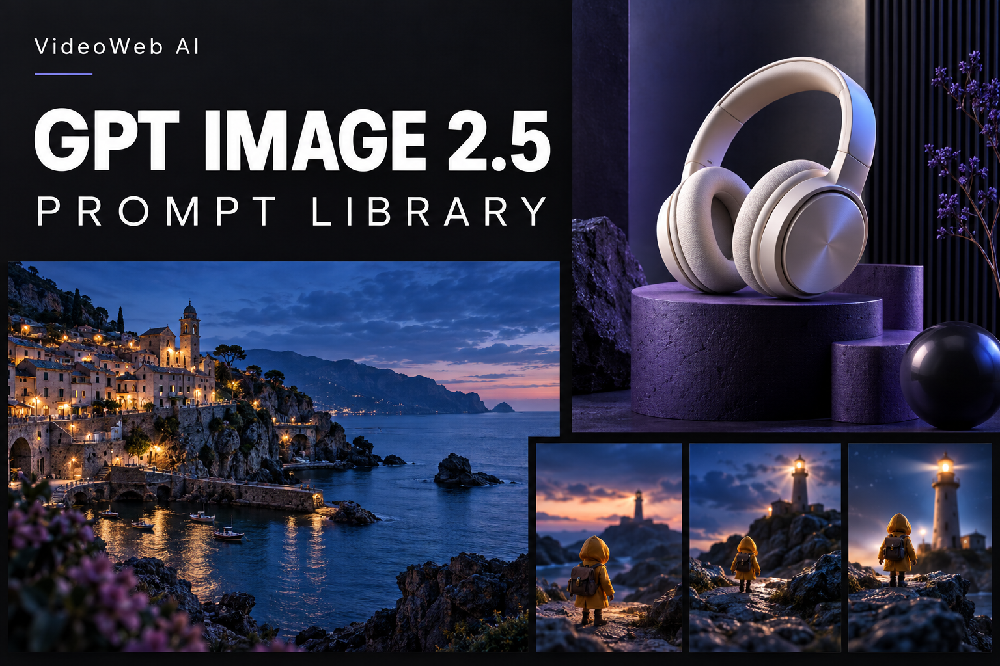

# Prompt per ChatGPT Images 2.5 — VideoWeb AI

Crea immagini e prepara i tuoi progetti video con VideoWeb AI.

[English](README.md) · [简体中文](README_zh.md) · [繁體中文](README_tw.md) · [日本語](README_ja.md) · [한국어](README_ko.md) · [Español](README_es.md) · [Français](README_fr.md) · [Deutsch](README_de.md) · [Português (Brasil)](README_pt.md) · **Italiano** · [Русский](README_ru.md) · [العربية](README_ar.md) · [हिन्दी](README_hi.md) · [ไทย](README_th.md) · [Bahasa Indonesia](README_id.md) · [Tiếng Việt](README_vi.md)



La raccolta comprende 106 ricette in 16 sezioni e 144 nuove immagini: 78 ricette complete in inglese e cinese semplificato, più 12 ricette dedicate a singole lingue. Il README è disponibile in 16 versioni linguistiche e regionali. Questa pagina introduce la raccolta in italiano, senza tradurre tutti i prompt. Si aggiungono 16 nuove ricette di workflow disponibili solo in inglese.


**[Galleria delle 106 ricette illustrate](docs/gallery.md)**

## Prova VideoWeb AI

Crea immagini e prepara i tuoi progetti video con VideoWeb AI.

**[Usa GPT Image 2.5](https://videoweb.ai/model/gpt-image-2-5/) · [Prova gratis senza registrazione](https://videoweb.ai/free-gpt-image-2-5/)**


## Come iniziare

Scegli una ricetta nell’[indice](prompts/README.md). Per modificare un’immagine, allega i riferimenti indicati e distingui ciò che deve cambiare da ciò che va conservato. Controlla il risultato e usa la versione approvata come base per la modifica successiva.

## Prova in italiano

[↗ L005](prompts/11-multilingual.md#l005)

```text
Crea un poster verticale 2:3 per una caffetteria immaginaria. Su carta color crema, mostra una tazza di ceramica blu con caffè e un cucchiaino, illuminati dalla luce laterale del mattino. In alto scrivi esattamente "UN CAFFÈ, SENZA FRETTA", sotto "Concediti una pausa" e in basso "CAFFÈ DI QUARTIERE". Usa caratteri blu scuro, margini ampi e una gerarchia chiara. Conserva gli accenti e la virgola, senza aggiungere prezzi o indirizzi.
```

Prima genera l’immagine con il prompt qui sopra e salva il risultato approvato. Poi carica quell’immagine ed esegui solo questa modifica:

```text
Nella modifica successiva cambia soltanto il colore della tazza in verde oliva, mantenendo testo, ombre e composizione.
```

Controlla l’accento in CAFFÈ, la virgola e l’assenza di parole aggiuntive.

## Dall’obiettivo al risultato

- Per un poster, usa l’esempio in italiano qui sopra. Per una pubblicità di prodotto, inizia da [P094 (EN / 简中)](prompts/16-videoweb-x-creators.md#p094).
- Genera e salva l’immagine, quindi caricala seguendo l’[esempio di una singola modifica](docs/editing-case-study.md).
- Confronta il risultato con [altri esempi illustrati](docs/gallery.md).

[Confronto degli strumenti (EN / 简中)](docs/tools.md)

Le ricette e le guide collegate sono principalmente in inglese e cinese semplificato.

## Stato degli esempi

Il prompt di questa pagina adatta L005 all’italiano: non è una nuova ricetta e non ha ancora un’immagine generata. Le immagini del progetto provengono dallo strumento integrato di Codex, che non ha restituito l’ID del modello. Non sono un confronto verificato tra Flare e Sunburst. Controlla testi, quantità e forme.


## Collaborazione di affiliazione

Accogliamo partner che condividono tutorial e progetti creativi con VideoWeb AI. Consulta le condizioni del programma.

**[Collaborazione di affiliazione](https://videoweb.ai/affiliate-program/)**

[Source & license / Flaq AI](docs/upstream.md) · [VideoWeb workflows (EN / 中文)](docs/videoweb-workflow.md)

[P092–P094 · EN / 中文](prompts/16-videoweb-x-creators.md) · [Video / 视频](docs/video-guide.md)
