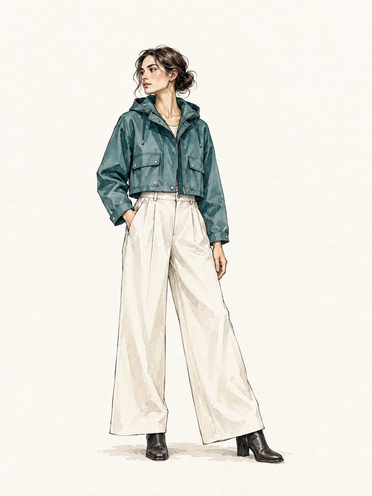
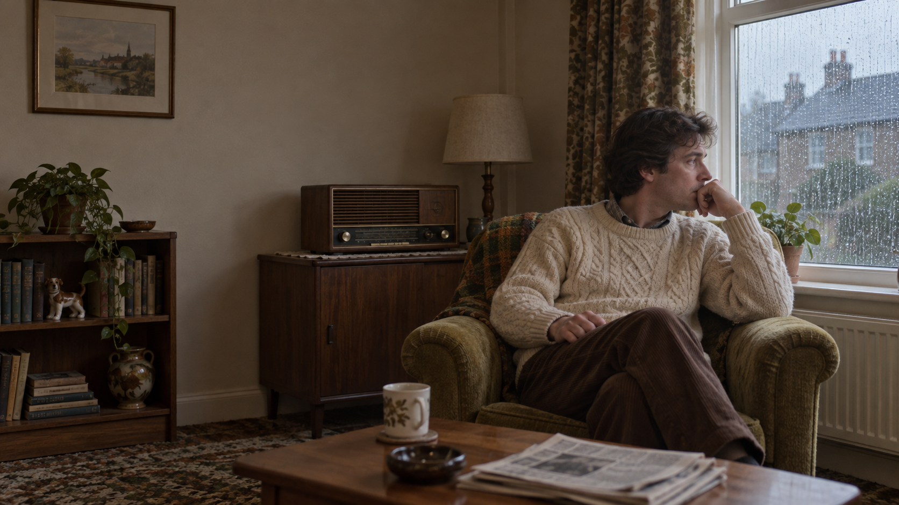

# VideoWeb creator briefs from X · VideoWeb 创作者 X 案例

[All recipes / 全部配方](README.md)

[Use GPT Image 2.5 / 开始创作](https://videoweb.ai/model/gpt-image-2-5/) · [Free, no signup / 免注册体验](https://videoweb.ai/free-gpt-image-2-5/)

Images 2.5 workflow focus: **Usable opening frames and wardrobe concepts / 可用开场帧与服装概念**.

Copy one language block. For edits, attach the images named in the prompt in that order. Requested ratios are creative targets; verify actual output dimensions.

任选一种语言复制。编辑任务须按提示顺序附参考图；比例为创作目标，输出后核对实际尺寸。

- [P092 · Fashion-film wardrobe concept](#p092)
- [P093 · Retro short-film opening frame](#p093)
- [P094 · Headphone launch key visual](#p094)

<a id="p092"></a>
## P092 · Fashion-film wardrobe concept / 时装短片服装概念

**Mode:** generate · **Target:** 3:4 · **Author:** VideoWeb AI team

**Best for:** Fashion-film wardrobe concept for a creator pitch or opening still.

**Inputs:** Text only. No input image required. For the next edit, upload the approved result.

**Production check:** Inspect at full size and at thumbnail size; compare structural details before approving. Download one clean still. Add final copy in an editor and use a separate video model for animation.

**Scenario source:** [Banana Prompts (@bananaprompts) on X](https://x.com/bananaprompts/status/2097453650100547924) · Published 2026-09-08 · Checked 2026-09-22.

**Source idea:** An outfit rendered as an editorial illustration.

**Source access:** Public FxTwitter metadata and TwStalker text checked; native X required login / returned 403.

**What changed:** Original expansion of the author’s fashion illustration idea into a film wardrobe concept; new clothing, framing and production constraints. The linked reply contains the source prompt.

[](https://x.com/bananaprompts/status/2097453650100547924/photo/1)

**External reference image:** [View the original photo on X](https://x.com/bananaprompts/status/2097453650100547924/photo/1). This is the source author’s image, not a rendering of the adapted prompt below. It is hosted remotely and is outside this repository’s MIT license. The model attribution is the author’s claim, not an independent verification. [Curation notes](../docs/x-community.md).

**Original prompt reply:** [Read the author’s prompt](https://x.com/bananaprompts/status/2097453653170790659).

**Generated example / 已生成示例：** Exact executed prompts and review notes are in the [generation log](../docs/generation-log.md). These examples do not verify every template variation.



[VideoWeb P092 generated concept: exact prompt / 实际提示词](../assets/generation/p092-videoweb.txt)

**Observed review:** Full body, boots, jacket details and ink/watercolor style are visible. One hand is tucked in a pocket, so this is not a full hand/anatomy reference. Title space is present but modest; add final copy in an editor.

### Customize

**Jacket color:** Teal. **Alternatives:** Ochre, burgundy or your approved palette. **Preserve:** Garment silhouette, pose, trousers, boots and illustration style.

### English

```text
Asset: Fashion-film wardrobe concept. Target aspect ratio: 3:4. Mode: generate.
Create a vertical 3:4 wardrobe concept for a fictional fashion film. Show one adult model in a teal cropped rain jacket, ivory wide-leg trousers and dark ankle boots, full body with both feet visible. Use expressive ink contours and restrained watercolor washes on warm white paper. Keep the silhouette clearly readable, with generous blank space above the head for a title added later. The model faces three-quarters left with relaxed hands; show the jacket closure and pockets clearly. This is a costume design illustration, not a photo of a real person.
Constraints: No lettering, logos or additional figures. Do not crop feet or hide garment construction.
Render only explicitly requested image text. Do not add unrelated logos, signatures or captions.
```

### 简体中文

```text
交付物：时装短片服装概念。目标比例：3:4。模式：新建。
为虚构时装短片制作竖版3:4服装概念图。一位成年模特穿青绿色短雨衣、象牙白阔腿裤和深色短靴，完整展示全身和双脚。用清晰墨线配合克制的水彩晕染，背景为暖白纸面。人物轮廓清楚，头顶预留后期加标题的空白。人物朝左侧四分之三方向，双手放松；雨衣门襟和口袋应可辨认。这是服装设计插画，不是真人照片。
约束：不要文字、标识或其他人物；不要裁掉双脚或遮住衣服结构。
只渲染明确要求的图中文字，不添加无关标识、签名或说明。
```

### Next edit / 后续修改

```text
Change only the rain jacket to ochre yellow. Preserve the pose, face, trousers, boots, ink style and blank title area.
```

```text
只把雨衣改成赭黄色，保留姿势、面部、裤子、靴子、墨线风格及标题留白。
```

**Review / 验收：** Check silhouette, anatomy or product geometry, usable title space and visual consistency. Follow-up and motion suggestions have not been executed. 检查轮廓、人体或产品结构、标题留白及画面一致性。后续修改和视频建议尚未执行。

[Back to index / 返回索引](README.md)


<a id="p093"></a>
## P093 · Retro short-film opening frame / 复古短片开场帧

**Mode:** generate · **Target:** 16:9 · **Author:** VideoWeb AI team

**Best for:** Retro short-film opening frame for a creator pitch or opening still.

**Inputs:** Text only. No input image required. For the next edit, upload the approved result.

**Production check:** Inspect at full size and at thumbnail size; compare structural details before approving. Download one clean still. Add final copy in an editor and use a separate video model for animation.

**Scenario source:** [Banana Prompts (@bananaprompts) on X](https://x.com/bananaprompts/status/2097420057919848639) · Published 2026-09-08 · Checked 2026-09-22.

**Source idea:** An 1980s photo aesthetic presented by the author as a GPT Image 2.5 test.

**Source access:** Public FxTwitter metadata and TwStalker text checked; native X required login / returned 403.

**What changed:** New text-to-image scene inspired by a retro-photo demonstration. The source post does not disclose a complete prompt; the brief below is authored by VideoWeb AI, not a transcription.

[](https://x.com/bananaprompts/status/2097420057919848639/photo/1)

**External reference image:** [View the original photo on X](https://x.com/bananaprompts/status/2097420057919848639/photo/1). This is the source author’s image, not a rendering of the adapted prompt below. It is hosted remotely and is outside this repository’s MIT license. The model attribution is the author’s claim, not an independent verification. [Curation notes](../docs/x-community.md).

**Generated example / 已生成示例：** Exact executed prompts and review notes are in the [generation log](../docs/generation-log.md). These examples do not verify every template variation.



[VideoWeb P093 generated concept: exact prompt / 实际提示词](../assets/generation/p093-videoweb.txt)

**Observed review:** Rainy window, knit sweater, wood radio and restrained retro styling are visible. The left wall includes a framed picture and shelf; it does not fully satisfy the uncluttered title-space request. Use as a mood frame or remove those objects before adding a title. Period accuracy is not independently verified.

### Customize

**Room setting:** Modest 1980s living room. **Alternatives:** Your documented region and decade, with specific furnishings. **Preserve:** Person, camera position, quiet mood and title space.

### English

```text
Asset: Retro short-film opening frame. Target aspect ratio: 16:9. Mode: generate.
Create a landscape 16:9 opening still for a fictional short film set in a modest 1980s living room. An adult in a cream cable-knit sweater sits beside a wood-veneer radio, looking toward a rain-streaked window. Frame a medium-wide eye-level shot, with the person on the right third and uncluttered wall space at left. Use soft overcast window light, faded olive upholstery and restrained warm film grain. Show a plausible room with consistent perspective and believable hands. The quiet mood should support a slow camera push in a later, separate video workflow.
Constraints: No modern screens, smartphones, readable brand marks, date stamps or neon fantasy colors.
Render only explicitly requested image text. Do not add unrelated logos, signatures or captions.
```

### 简体中文

```text
交付物：复古短片开场帧。目标比例：16:9。模式：新建。
为虚构的复古短片制作横版16:9开场静帧，场景为20世纪80年代一间朴素客厅。一位穿米白绞花毛衣的成年人坐在木纹收音机旁，看向带雨痕的窗户。平视中远景，人物位于右侧三分之一，左侧墙面保持干净。使用阴天柔和窗光、褪色橄榄绿座椅和克制的暖色胶片颗粒。房间透视合理，手部自然。安静的构图应适合之后在独立视频工具中做缓慢推进。
约束：不要现代屏幕、智能手机、可读品牌、日期水印或夸张霓虹色。
只渲染明确要求的图中文字，不添加无关标识、签名或说明。
```

### Next edit / 后续修改

```text
Change only the upholstery to muted rust red; keep the person, room geometry, window light, radio and framing unchanged.
```

```text
只把座椅布面改成低饱和铁锈红，保留人物、房间结构、窗光、收音机和构图。
```

**Review / 验收：** Check silhouette, anatomy or product geometry, usable title space and visual consistency. Follow-up and motion suggestions have not been executed. 检查轮廓、人体或产品结构、标题留白及画面一致性。后续修改和视频建议尚未执行。

[Back to index / 返回索引](README.md)


<a id="p094"></a>
## P094 · Headphone launch key visual / 耳机发布主视觉

**Mode:** generate · **Target:** 16:9 · **Author:** VideoWeb AI team

**Best for:** Headphone launch key visual for a creator pitch or opening still.

**Inputs:** Text only. No input image required. For the next edit, upload the approved result.

**Production check:** Inspect at full size and at thumbnail size; compare structural details before approving. Download one clean still. Add final copy in an editor and use a separate video model for animation.

**Scenario source:** [Banana Prompts (@bananaprompts) on X](https://x.com/bananaprompts/status/2098200383143207088) · Published 2026-09-11 · Checked 2026-09-22.

**Source idea:** A collection of fashion, beauty and product campaign examples.

**Source access:** Public FxTwitter metadata and TwStalker text checked; native X required login / returned 403.

**What changed:** Original headphone campaign inspired by the post’s general product-ad use case. The post announces a prompt collection but contains no complete individual prompt; this is not the author’s exact recipe.

[](https://x.com/bananaprompts/status/2098200383143207088/photo/1)

**External reference image:** [View the original photo on X](https://x.com/bananaprompts/status/2098200383143207088/photo/1). This is the source author’s image, not a rendering of the adapted prompt below. It is hosted remotely and is outside this repository’s MIT license. The model attribution is the author’s claim, not an independent verification. [Curation notes](../docs/x-community.md).

**Generated example / 已生成示例：** Exact executed prompts and review notes are in the [generation log](../docs/generation-log.md). These examples do not verify every template variation.


[VideoWeb P094 generated concept: exact prompt / 实际提示词](../assets/generation/p094-videoweb.txt)

**Observed review:** A single ivory headset sits on a violet pedestal with useful empty space at left and no text. Headband and cushions read clearly; small mechanical joints are conceptual and should not serve as a real-product specification.

### Customize

**Pedestal color:** Violet. **Alternatives:** Muted blue or a brand-approved neutral. **Preserve:** Headset geometry, ivory material, lighting and empty copy area.

### English

```text
Asset: Headphone launch key visual. Target aspect ratio: 16:9. Mode: generate.
Create a landscape 16:9 campaign still for fictional unbranded over-ear headphones. Place one ivory headset with a continuous padded headband and two oval ear cups on a low violet stone pedestal at the right of a charcoal studio. Use a broad soft key light from upper left, a subtle cool rim, realistic leather texture and a grounded contact shadow. Leave the left forty percent empty for an editor to add approved launch copy. The product must have plausible symmetric construction, clean contours and no floating parts. Compose a single shot suitable as the opening frame of a slow product reveal.
Constraints: No text, logo, cable, extra headset or speculative product specification.
Render only explicitly requested image text. Do not add unrelated logos, signatures or captions.
```

### 简体中文

```text
交付物：耳机发布主视觉。目标比例：16:9。模式：新建。
为虚构无品牌头戴耳机制作横版16:9广告静帧。只有一副象牙白耳机，连续软垫头梁配两个椭圆耳罩，放在深炭灰影棚右侧的低矮紫色石台上。左上方大面积柔光，少量冷色轮廓光，皮革纹理自然，接触阴影可信。左侧四成区域留白，供剪辑人员后期添加批准的文案。产品结构对称合理，轮廓清晰，没有悬浮零件。单镜头构图适合作为缓慢产品展示视频的开场帧。
约束：不要文字、商标、线缆、额外耳机或虚构产品参数。
只渲染明确要求的图中文字，不添加无关标识、签名或说明。
```

### Next edit / 后续修改

```text
Change only the pedestal to muted blue. Preserve the headset shape, ivory material, shadow direction, camera and left-side copy area.
```

```text
只把石台改成低饱和蓝色，保留耳机形状、象牙白材质、阴影方向、相机及左侧文案留白。
```

**Review / 验收：** Check silhouette, anatomy or product geometry, usable title space and visual consistency. Follow-up and motion suggestions have not been executed. 检查轮廓、人体或产品结构、标题留白及画面一致性。后续修改和视频建议尚未执行。

[Back to index / 返回索引](README.md)
